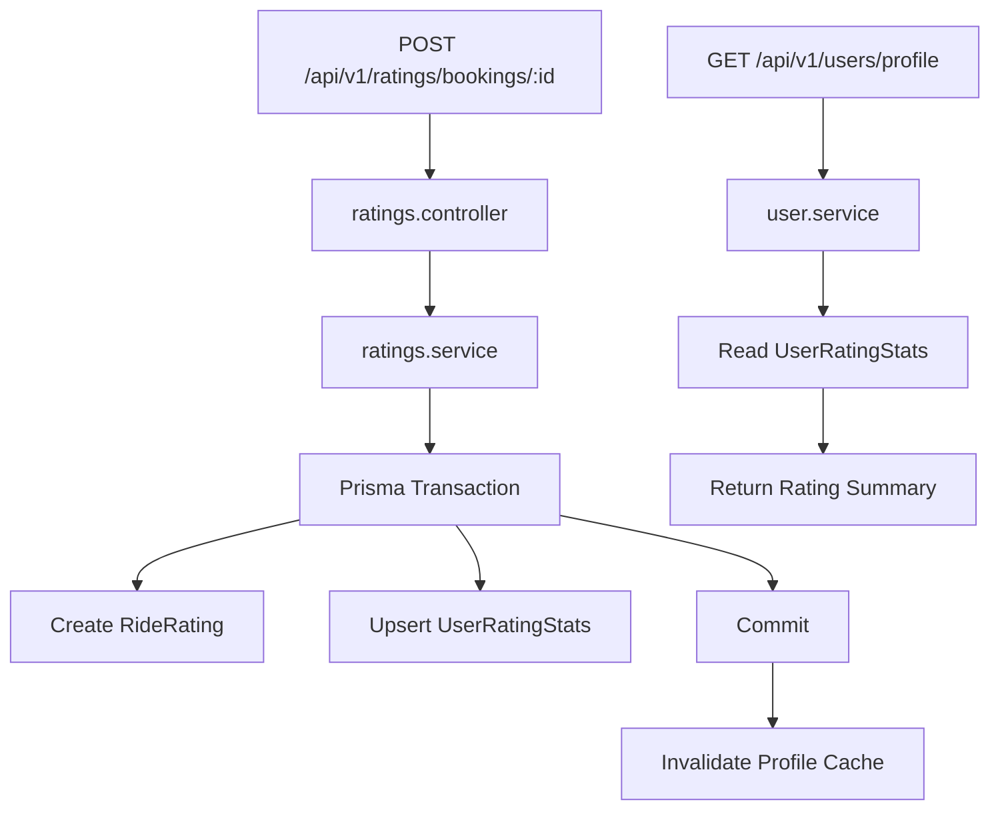

# Design Document: Booking Completion User Rating System

## Overview

This design implements a two-way post-completion rating system for a carpooling application. After a ride booking reaches `COMPLETED` status, both the passenger and driver can rate each other exactly once. The system captures immutable rating events (1-5 stars + optional review text) and maintains denormalized aggregate statistics per user for efficient profile queries.

### Key Design Principles

- **Immutability**: Rating events are write-once, never modified
- **Transactional Consistency**: Rating creation and stats updates occur atomically
- **Denormalization**: Aggregate statistics are precomputed for fast profile reads
- **Cache Coherence**: Profile cache is invalidated immediately after rating submission
- **Authorization**: Only booking participants can rate, and only after completion

### Architecture Overview

The rating system consists of three main components:

1. **Rating Event Storage** (`RideRating` model): Immutable records of individual ratings
2. **Aggregate Statistics** (`UserRatingStats` model): Denormalized counters and averages per user
3. **Profile Integration**: Rating summary exposed in user profile responses



## Architecture

### Module Structure

The rating system is implemented as a dedicated module following the existing codebase patterns:

```
src/modules/ratings/
├── ratings.types.ts          # TypeScript interfaces
├── ratings.validator.ts      # Zod validation schemas
├── ratings.service.ts        # Business logic and transactions
├── ratings.controller.ts     # HTTP handling and cache invalidation
├── ratings.routes.ts         # Route definitions
└── tests/
    ├── ratings.service.test.ts
    ├── ratings.routes.mount.test.ts
    └── ratings.prisma-contract.test.ts
```

### Responsibility Boundaries

- **Prisma Schema**: Defines storage models, relations, and database constraints
- **ratings.service.ts**: Owns all business rules, eligibility checks, and transactional writes
- **ratings.controller.ts**: Maps domain errors to HTTP responses, triggers cache invalidation
- **ratings.routes.ts**: Wires Express routes with validation middleware
- **user.service.ts**: Reads precomputed rating stats for profile responses (no rating logic)

### Integration Points

1. **Authentication Middleware**: Extracts authenticated user ID for rater identification
2. **Booking System**: Validates booking existence, status, and participant roles
3. **Cache Service**: Invalidates ratee profile cache after successful rating
4. **User Profile**: Extends profile response with rating summary

## Components and Interfaces

### API Endpoint

**POST /api/v1/ratings/bookings/:bookingId**

- **Authentication**: Required (Bearer token)
- **Authorization**: Rater must be booking participant (passenger or driver)
- **Request Body**:
  ```typescript
  {
    stars: number;        // Required, integer 1-5
    reviewText?: string;  // Optional, max 500 characters
  }
  ```
- **Success Response** (201):
  ```typescript
  {
    success: true,
    status: "CREATED",
    message: "Rating submitted successfully",
    data: {
      id: string;
      bookingId: string;
      rideId: string;
      raterId: string;
      rateeId: string;
      stars: number;
      reviewText: string | null;
      createdAt: Date;
    }
  }
  ```

### Service Interface

```typescript
// ratings.types.ts
export interface SubmitRatingInput {
  stars: number;
  reviewText?: string;
}

export interface SubmittedRating {
  id: string;
  bookingId: string;
  rideId: string;
  raterId: string;
  rateeId: string;
  stars: number;
  reviewText: string | null;
  createdAt: Date;
}

// ratings.service.ts
export const submitBookingRating = async (
  raterId: string,
  bookingId: string,
  input: SubmitRatingInput
): Promise<SubmittedRating>
```

### Validation Schemas

```typescript
// ratings.validator.ts
export const submitRatingParamsSchema = z.object({
  bookingId: z.string().uuid('Invalid booking ID'),
});

export const submitRatingBodySchema = z.object({
  stars: z.number().int().min(1).max(5),
  reviewText: z.string().trim().max(500).optional(),
});
```

### Profile Integration

```typescript
// user.types.ts
export interface UserRatingSummary {
  average: number | null;  // Null if no ratings
  total: number;           // Count of ratings received
  label: string | null;    // "No ratings yet" if total = 0, else null
}

// Extended FullProfileResponse
export interface FullProfileResponse {
  user: UserBasicInfo;
  travelPreference: TravelPreferenceData | null;
  vehicle: VehicleSummary | null;
  stats: UserStats;
  rating: UserRatingSummary;  // NEW
}
```

## Data Models

### RideRating (Immutable Event)

```prisma
model RideRating {
  id String @id @default(uuid())

  bookingId String
  booking   RideBooking @relation(fields: [bookingId], references: [id], onDelete: Cascade)

  rideId String
  ride   Ride @relation(fields: [rideId], references: [id], onDelete: Cascade)

  raterId String
  rater   User @relation("RatingsGiven", fields: [raterId], references: [id], onDelete: Cascade)

  rateeId String
  ratee   User @relation("RatingsReceived", fields: [rateeId], references: [id], onDelete: Cascade)

  stars      Int      // 1-5
  reviewText String?  // Optional, max 500 chars

  createdAt DateTime @default(now())
  updatedAt DateTime @updatedAt

  @@unique([bookingId, raterId])  // One rating per rater per booking
  @@index([bookingId])
  @@index([rateeId, createdAt])   // For ratee's rating history
}
```

**Design Rationale**:
- `@@unique([bookingId, raterId])`: Enforces one-rating-per-participant-per-booking at database level
- `raterId` and `rateeId`: Explicit denormalization for query efficiency (avoid joins to determine who rated whom)
- `rideId`: Redundant but useful for ride-level analytics without joining through booking
- No update/delete operations: Immutability enforced by service layer (no update methods)

### UserRatingStats (Denormalized Aggregates)

```prisma
model UserRatingStats {
  id String @id @default(uuid())

  userId String @unique
  user   User   @relation(fields: [userId], references: [id], onDelete: Cascade)

  totalRatings  Int   @default(0)  // Count of ratings received
  totalStars    Int   @default(0)  // Sum of all stars received
  averageRating Float @default(0)  // Precomputed average (2 decimal places)

  createdAt DateTime @default(now())
  updatedAt DateTime @updatedAt

  @@index([averageRating])  // For future leaderboard queries
}
```

**Design Rationale**:
- **Denormalization**: Avoids expensive aggregation queries on profile reads
- **Incremental Updates**: Stats updated transactionally with each rating
- **Precision**: `averageRating` stored as Float, rounded to 2 decimals in application layer
- **Lazy Creation**: Stats row created on first rating received (not at user creation)

### User Model Extensions

```prisma
model User {
  // ... existing fields ...
  ratingsGiven    RideRating[]     @relation("RatingsGiven")
  ratingsReceived RideRating[]     @relation("RatingsReceived")
  ratingStats     UserRatingStats?
}
```

### Ride and RideBooking Extensions

```prisma
model Ride {
  // ... existing fields ...
  ratings RideRating[]
}

model RideBooking {
  // ... existing fields ...
  ratings RideRating[]
}
```

## Business Logic

### Rating Submission Flow

1. **Input Validation** (ratings.validator.ts)
   - Validate `bookingId` is valid UUID
   - Validate `stars` is integer between 1-5
   - Validate `reviewText` is ≤500 characters (if provided)

2. **Eligibility Checks** (ratings.service.ts)
   - Booking exists (`BOOKING_NOT_FOUND`)
   - Booking status is `COMPLETED` (`BOOKING_NOT_COMPLETED`)
   - Rater is participant (passenger or driver) (`NOT_BOOKING_PARTICIPANT`)
   - Ratee ≠ Rater (`SELF_RATING_NOT_ALLOWED`)
   - No existing rating from this rater for this booking (`RATING_ALREADY_SUBMITTED`)

3. **Ratee Determination**
   - If rater is passenger → ratee is driver
   - If rater is driver → ratee is passenger

4. **Review Text Normalization**
   - Trim whitespace
   - If empty or whitespace-only → store `null`
   - Otherwise → store trimmed text

5. **Transactional Write** (Prisma transaction)
   ```typescript
   await prisma.$transaction(async (tx) => {
     // 1. Create rating event
     const rating = await tx.rideRating.create({ ... });
     
     // 2. Upsert stats
     const existingStats = await tx.userRatingStats.findUnique({ 
       where: { userId: rateeId } 
     });
     
     if (!existingStats) {
       // First rating: create stats row
       await tx.userRatingStats.create({
         data: {
           userId: rateeId,
           totalRatings: 1,
           totalStars: input.stars,
           averageRating: round2(input.stars),
         },
       });
     } else {
       // Subsequent rating: update stats
       const totalRatings = existingStats.totalRatings + 1;
       const totalStars = existingStats.totalStars + input.stars;
       await tx.userRatingStats.update({
         where: { userId: rateeId },
         data: {
           totalRatings,
           totalStars,
           averageRating: round2(totalStars / totalRatings),
         },
       });
     }
   });
   ```

6. **Cache Invalidation** (ratings.controller.ts)
   ```typescript
   await deleteCache(cacheKeys.userProfile(rating.rateeId));
   ```

### Average Rating Calculation

```typescript
const round2 = (value: number): number => Number(value.toFixed(2));

// Example: 3 ratings of 5, 4, 5 stars
// totalRatings = 3
// totalStars = 14
// averageRating = round2(14 / 3) = round2(4.666...) = 4.67
```

### Profile Rating Summary Mapping

```typescript
// user.service.ts - getFullProfileService
const ratingStats = await prisma.userRatingStats.findUnique({ 
  where: { userId } 
});

const rating = !ratingStats || ratingStats.totalRatings === 0
  ? {
      average: null,
      total: 0,
      label: 'No ratings yet',
    }
  : {
      average: Number(ratingStats.averageRating.toFixed(2)),
      total: ratingStats.totalRatings,
      label: null,
    };
```

## Correctness Properties

*A property is a characteristic or behavior that should hold true across all valid executions of a system—essentially, a formal statement about what the system should do. Properties serve as the bridge between human-readable specifications and machine-verifiable correctness guarantees.*

### Property 1: Valid Completed Booking Rating Acceptance

*For any* completed booking and any valid participant (passenger or driver), when that participant submits a rating with valid stars (1-5) for the first time, the system SHALL create a RideRating event with correct bookingId, rideId, raterId, rateeId, stars, and reviewText.

**Validates: Requirements 1.1, 2.1, 5.1**

### Property 2: Non-Completed Booking Rejection

*For any* booking with status other than `COMPLETED` (DRAFT, PUBLISHED, IN_PROGRESS, CANCELLED, PAYMENT_PENDING, DRIVER_PENDING, CONFIRMED, PAYMENT_FAILED), when a participant attempts to submit a rating, the system SHALL reject with error code `BOOKING_NOT_COMPLETED`.

**Validates: Requirements 1.2**

### Property 3: Non-Participant Rejection

*For any* booking and any user who is neither the passenger nor the driver of that booking, when that user attempts to submit a rating, the system SHALL reject with error code `NOT_BOOKING_PARTICIPANT`.

**Validates: Requirements 1.3**

### Property 4: Duplicate Rating Prevention

*For any* booking and any participant who has already submitted a rating for that booking, when that participant attempts to submit another rating for the same booking, the system SHALL reject with error code `RATING_ALREADY_SUBMITTED`.

**Validates: Requirements 2.2**

### Property 5: Bidirectional Rating Independence

*For any* completed booking, when both the passenger and driver submit ratings for each other, the system SHALL create two separate RideRating events with correct raterId/rateeId pairs (passenger rates driver, driver rates passenger).

**Validates: Requirements 2.4**

### Property 6: Star Value Validation

*For any* rating submission with stars value outside the range [1, 5] or with non-integer stars value, the system SHALL reject with error code `INVALID_RATING_VALUE`.

**Validates: Requirements 3.2, 3.3**

### Property 7: Review Text Length Validation

*For any* rating submission with reviewText exceeding 500 characters, the system SHALL reject with a validation error.

**Validates: Requirements 4.2**

### Property 8: Whitespace Review Text Normalization

*For any* rating submission with reviewText that is empty or contains only whitespace characters, the system SHALL store `null` in the reviewText field of the created RideRating.

**Validates: Requirements 4.3**

### Property 9: First Rating Stats Initialization

*For any* user receiving their first rating with N stars, the system SHALL create a UserRatingStats record with totalRatings = 1, totalStars = N, and averageRating = N (rounded to 2 decimals).

**Validates: Requirements 6.2**

### Property 10: Subsequent Rating Stats Accumulation

*For any* user with existing UserRatingStats receiving a new rating with N stars, the system SHALL update the stats by incrementing totalRatings by 1, adding N to totalStars, and recalculating averageRating = (totalStars / totalRatings) rounded to 2 decimals.

**Validates: Requirements 6.3, 6.4**

### Property 11: Transactional Atomicity

*For any* rating submission, if the RideRating creation succeeds, the UserRatingStats update SHALL also succeed within the same transaction, and if either operation fails, both SHALL be rolled back.

**Validates: Requirements 6.1, 6.5**

### Property 12: Profile Rating Summary Structure

*For any* user profile request, the response SHALL include a rating summary object with fields: average (number | null), total (number), and label (string | null).

**Validates: Requirements 7.1**

### Property 13: Rated User Profile Summary

*For any* user with totalRatings > 0, when their profile is requested, the rating summary SHALL have average = averageRating (rounded to 2 decimals), total = totalRatings, and label = null.

**Validates: Requirements 7.2**

### Property 14: Cache Invalidation on Rating

*For any* successful rating submission, the system SHALL call deleteCache with the ratee's profile cache key.

**Validates: Requirements 8.1**

### Property 15: Self-Rating Prevention

*For any* booking where the rater and ratee would be the same user, the system SHALL reject with error code `SELF_RATING_NOT_ALLOWED`.

**Validates: Requirements 10.1**

### Property 16: Ratee Determination by Role

*For any* completed booking, when the passenger submits a rating, the ratee SHALL be the driver, and when the driver submits a rating, the ratee SHALL be the passenger.

**Validates: Requirements 10.2**

## Error Handling

### Domain Errors

The service layer throws errors with specific codes that are mapped to HTTP responses by the controller:

| Error Code | HTTP Status | Message | Trigger Condition |
|------------|-------------|---------|-------------------|
| `BOOKING_NOT_FOUND` | 404 | "Booking not found" | Booking ID doesn't exist |
| `NOT_BOOKING_PARTICIPANT` | 403 | "You are not a participant in this booking" | Rater is neither passenger nor driver |
| `BOOKING_NOT_COMPLETED` | 409 | "Rating is allowed only after trip completion" | Booking status ≠ COMPLETED |
| `RATING_ALREADY_SUBMITTED` | 409 | "Rating already submitted for this booking" | Duplicate rating attempt |
| `INVALID_RATING_VALUE` | 400 | "Stars must be an integer between 1 and 5" | Stars < 1 or > 5 or non-integer |
| `SELF_RATING_NOT_ALLOWED` | 400 | "Self rating is not allowed" | Rater = Ratee |
| (Validation errors) | 400 | Zod validation messages | Invalid UUID, missing stars, reviewText too long |
| (Uncaught errors) | 500 | "Failed to submit rating" | Database errors, unexpected failures |

### Error Mapping Implementation

```typescript
// ratings.controller.ts
const mapRatingError = (error: Error) => {
  switch (error.message) {
    case 'BOOKING_NOT_FOUND':
      return { status: HttpStatus.NOT_FOUND, message: 'Booking not found' };
    case 'NOT_BOOKING_PARTICIPANT':
      return { status: HttpStatus.FORBIDDEN, message: 'You are not a participant in this booking' };
    case 'BOOKING_NOT_COMPLETED':
      return { status: HttpStatus.CONFLICT, message: 'Rating is allowed only after trip completion' };
    case 'RATING_ALREADY_SUBMITTED':
      return { status: HttpStatus.CONFLICT, message: 'Rating already submitted for this booking' };
    case 'INVALID_RATING_VALUE':
      return { status: HttpStatus.BAD_REQUEST, message: 'Stars must be an integer between 1 and 5' };
    case 'SELF_RATING_NOT_ALLOWED':
      return { status: HttpStatus.BAD_REQUEST, message: 'Self rating is not allowed' };
    default:
      return { status: HttpStatus.INTERNAL_ERROR, message: 'Failed to submit rating' };
  }
};
```

### Cache Invalidation Error Handling

Cache invalidation failures are logged but do not fail the rating submission:

```typescript
try {
  await deleteCache(cacheKeys.userProfile(rating.rateeId));
} catch (cacheError) {
  console.error('Cache invalidation failed:', cacheError);
  // Continue - rating was successfully saved
}
```

**Rationale**: Cache invalidation is a performance optimization. If it fails, the profile will be stale until cache TTL expires, but the rating data is safely persisted.

## Testing Strategy

### Unit Tests

**Focus**: Business logic, validation, error conditions, and data transformations

**Test Files**:
- `ratings.service.test.ts`: Service layer business rules
- `ratings.controller.test.ts`: Error mapping and cache invalidation
- `user.service.rating.test.ts`: Profile rating summary mapping

**Key Test Cases**:
1. **Eligibility Checks**:
   - Passenger can rate driver on completed booking
   - Driver can rate passenger on completed booking
   - Reject non-completed bookings
   - Reject non-participants
   - Reject duplicate ratings
   - Reject self-ratings

2. **Validation**:
   - Accept stars 1-5
   - Reject stars < 1 or > 5
   - Reject non-integer stars
   - Accept optional reviewText
   - Reject reviewText > 500 chars
   - Normalize whitespace-only reviewText to null

3. **Stats Management**:
   - Create stats on first rating
   - Update stats on subsequent ratings
   - Correct average calculation and rounding
   - Transactional rollback on failure

4. **Profile Integration**:
   - Return "No ratings yet" for unrated users
   - Return correct average and total for rated users
   - Correct data source (UserRatingStats)

### Integration Tests

**Focus**: Database constraints, transaction behavior, endpoint mounting

**Test Files**:
- `ratings.prisma-contract.test.ts`: Prisma delegate existence
- `ratings.routes.mount.test.ts`: Route mounting verification

**Key Test Cases**:
1. **Database Constraints**:
   - Unique constraint on (bookingId, raterId)
   - Foreign key cascades
   - Index existence

2. **Endpoint Mounting**:
   - POST /api/v1/ratings/bookings/:bookingId returns non-404
   - Authentication middleware applied

### Property-Based Tests

**Library**: fast-check (JavaScript/TypeScript PBT library)

**Configuration**: Minimum 100 iterations per property test

**Test Organization**: Each correctness property maps to one property-based test with tag comment:

```typescript
// Feature: booking-completion-user-rating, Property 1: Valid Completed Booking Rating Acceptance
fc.assert(
  fc.property(
    fc.record({
      bookingId: fc.uuid(),
      stars: fc.integer({ min: 1, max: 5 }),
      reviewText: fc.option(fc.string({ maxLength: 500 })),
    }),
    async (input) => {
      // Test implementation
    }
  ),
  { numRuns: 100 }
);
```

**Property Test Coverage**:
- Properties 1-16 from Correctness Properties section
- Each property test generates random valid/invalid inputs
- Verifies universal behavior across input space

### OpenAPI Documentation Tests

**Tools**: Redocly OpenAPI CLI

**Commands**:
- `npm run openapi:bundle`: Bundle OpenAPI spec
- `npm run openapi:coverage`: Verify all mounted routes are documented
- `npm run openapi:check`: Validate spec consistency

**Coverage Requirements**:
- POST /api/v1/ratings/bookings/:bookingId documented
- Request/response schemas defined
- All error codes (400, 401, 403, 404, 409, 500) documented
- Example payloads provided
- Rating summary in profile response schema

### Test Execution Order

1. **Unit tests**: Fast, isolated, no database
2. **Integration tests**: Database required, slower
3. **Property-based tests**: Comprehensive input coverage, slowest
4. **OpenAPI tests**: Documentation consistency

### Continuous Integration

All tests must pass before merge:
```bash
npm run test                    # All unit + integration tests
npm run test:pbt                # Property-based tests
npm run build                   # TypeScript compilation
npm run openapi:check           # OpenAPI validation
```

## Implementation Notes

### Database Migration

```sql
-- Generated by Prisma: prisma/migrations/*_add_user_ratings/migration.sql

CREATE TABLE "RideRating" (
  "id" TEXT NOT NULL PRIMARY KEY,
  "bookingId" TEXT NOT NULL,
  "rideId" TEXT NOT NULL,
  "raterId" TEXT NOT NULL,
  "rateeId" TEXT NOT NULL,
  "stars" INTEGER NOT NULL,
  "reviewText" TEXT,
  "createdAt" TIMESTAMP(3) NOT NULL DEFAULT CURRENT_TIMESTAMP,
  "updatedAt" TIMESTAMP(3) NOT NULL,
  CONSTRAINT "RideRating_bookingId_fkey" FOREIGN KEY ("bookingId") REFERENCES "RideBooking"("id") ON DELETE CASCADE,
  CONSTRAINT "RideRating_rideId_fkey" FOREIGN KEY ("rideId") REFERENCES "Ride"("id") ON DELETE CASCADE,
  CONSTRAINT "RideRating_raterId_fkey" FOREIGN KEY ("raterId") REFERENCES "User"("id") ON DELETE CASCADE,
  CONSTRAINT "RideRating_rateeId_fkey" FOREIGN KEY ("rateeId") REFERENCES "User"("id") ON DELETE CASCADE
);

CREATE UNIQUE INDEX "RideRating_bookingId_raterId_key" ON "RideRating"("bookingId", "raterId");
CREATE INDEX "RideRating_bookingId_idx" ON "RideRating"("bookingId");
CREATE INDEX "RideRating_rateeId_createdAt_idx" ON "RideRating"("rateeId", "createdAt");

CREATE TABLE "UserRatingStats" (
  "id" TEXT NOT NULL PRIMARY KEY,
  "userId" TEXT NOT NULL,
  "totalRatings" INTEGER NOT NULL DEFAULT 0,
  "totalStars" INTEGER NOT NULL DEFAULT 0,
  "averageRating" DOUBLE PRECISION NOT NULL DEFAULT 0,
  "createdAt" TIMESTAMP(3) NOT NULL DEFAULT CURRENT_TIMESTAMP,
  "updatedAt" TIMESTAMP(3) NOT NULL,
  CONSTRAINT "UserRatingStats_userId_fkey" FOREIGN KEY ("userId") REFERENCES "User"("id") ON DELETE CASCADE
);

CREATE UNIQUE INDEX "UserRatingStats_userId_key" ON "UserRatingStats"("userId");
CREATE INDEX "UserRatingStats_averageRating_idx" ON "UserRatingStats"("averageRating");
```

### Performance Considerations

1. **Profile Reads**: O(1) lookup via `UserRatingStats.userId` unique index
2. **Rating Writes**: Single transaction with 2-3 queries (create rating + upsert stats)
3. **Cache Strategy**: Invalidate-on-write (no cache warming needed)
4. **Index Usage**:
   - `RideRating_bookingId_raterId_key`: Duplicate prevention
   - `RideRating_rateeId_createdAt_idx`: Future rating history queries
   - `UserRatingStats_averageRating_idx`: Future leaderboard queries

### Future Enhancements (Out of Scope)

- Rating history endpoint (GET /api/v1/users/:userId/ratings)
- Rating edit/delete (requires immutability policy decision)
- Rating moderation (flag inappropriate reviews)
- Leaderboard (top-rated users)
- Rating notifications (notify ratee when rated)
- Rating reminders (prompt users to rate after completion)

### Security Considerations

1. **Authentication**: All rating endpoints require valid JWT
2. **Authorization**: Only booking participants can rate
3. **Input Validation**: Zod schemas prevent injection attacks
4. **Rate Limiting**: Inherit from global Express rate limiter
5. **SQL Injection**: Prevented by Prisma parameterized queries
6. **XSS**: Review text stored as plain text, sanitized on frontend display

### Monitoring and Observability

**Metrics to Track**:
- Rating submission rate (ratings/hour)
- Rating distribution (1-5 stars histogram)
- Average rating per user cohort
- Cache invalidation failures
- Transaction rollback rate

**Logging**:
- Info: Successful rating submissions
- Warn: Cache invalidation failures
- Error: Transaction failures, unexpected errors

## OpenAPI Documentation

### Endpoint Definition

```yaml
# docs/openapi/paths/ratings.yaml
paths:
  /api/v1/ratings/bookings/{bookingId}:
    post:
      operationId: ratingsPostByBookingId
      summary: Submit rating for completed booking
      tags: [Ratings]
      security:
        - BearerAuth: []
      parameters:
        - name: bookingId
          in: path
          required: true
          schema:
            type: string
            format: uuid
      requestBody:
        required: true
        content:
          application/json:
            schema:
              type: object
              required: [stars]
              properties:
                stars:
                  type: integer
                  minimum: 1
                  maximum: 5
                reviewText:
                  type: string
                  maxLength: 500
      responses:
        '201':
          description: Rating submitted successfully
          content:
            application/json:
              schema:
                $ref: '../components/schemas/common.yaml#/ApiSuccessEnvelope'
              examples:
                default:
                  $ref: '../components/examples/common.yaml#/RatingSubmitSuccess'
        '400':
          $ref: '../components/responses/errors.yaml#/BadRequest'
        '401':
          $ref: '../components/responses/errors.yaml#/Unauthorized'
        '403':
          $ref: '../components/responses/errors.yaml#/Forbidden'
        '404':
          $ref: '../components/responses/errors.yaml#/NotFound'
        '409':
          $ref: '../components/responses/errors.yaml#/Conflict'
        '500':
          $ref: '../components/responses/errors.yaml#/ServerError'
```

### Example Responses

```yaml
# docs/openapi/components/examples/common.yaml
RatingSubmitSuccess:
  summary: Rating submitted response
  value:
    success: true
    status: CREATED
    message: Rating submitted successfully
    data:
      id: "44444444-4444-4444-4444-444444444444"
      bookingId: "55555555-5555-5555-5555-555555555555"
      rideId: "66666666-6666-6666-6666-666666666666"
      raterId: "77777777-7777-7777-7777-777777777777"
      rateeId: "88888888-8888-8888-8888-888888888888"
      stars: 5
      reviewText: "Smooth and safe ride"
      createdAt: "2026-04-08T12:00:00.000Z"

# Update UserProfileSuccess example to include rating
UserProfileSuccess:
  value:
    # ... existing fields ...
    rating:
      average: 4.67
      total: 12
      label: null
```

## Deployment Checklist

- [ ] Prisma migration applied to production database
- [ ] Environment variables verified (no new vars required)
- [ ] OpenAPI documentation deployed
- [ ] Monitoring dashboards updated with rating metrics
- [ ] Cache invalidation tested in staging
- [ ] Load testing completed (rating submission under load)
- [ ] Rollback plan documented
