# Architecture And Flow Diagrams

These diagrams use Mermaid syntax so they can be rendered by GitHub, many Markdown tools, and documentation portals.

## High-Level System Architecture

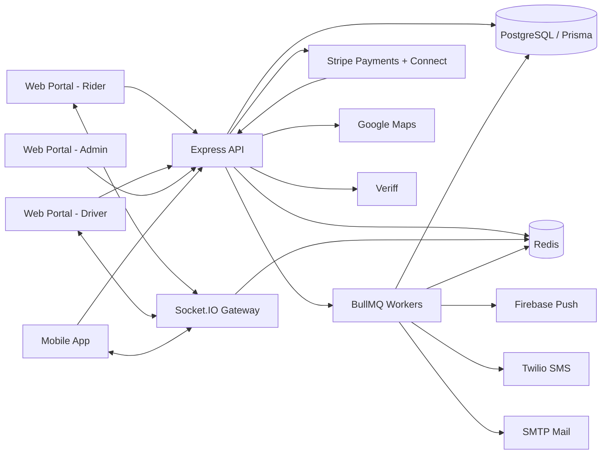

## Backend Request Lifecycle

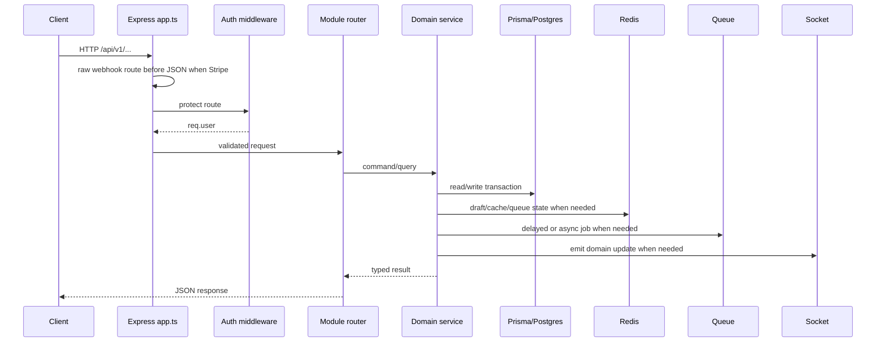

## Core Domain Model

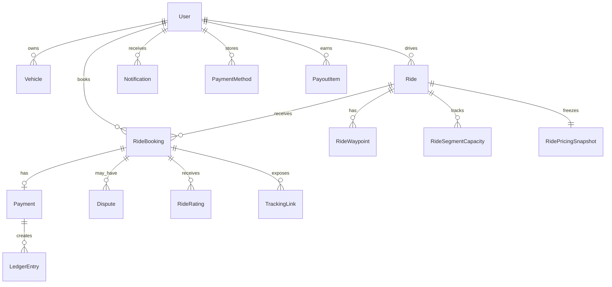

## Publish Ride Flow

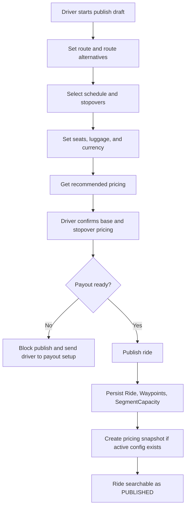

## Search And Booking Flow

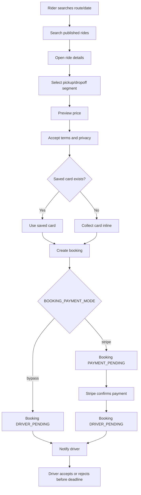

## Booking Request Expiry Flow

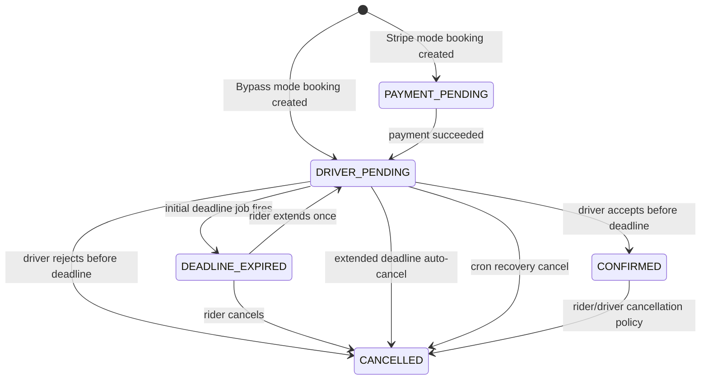

## Payment And Payout Flow

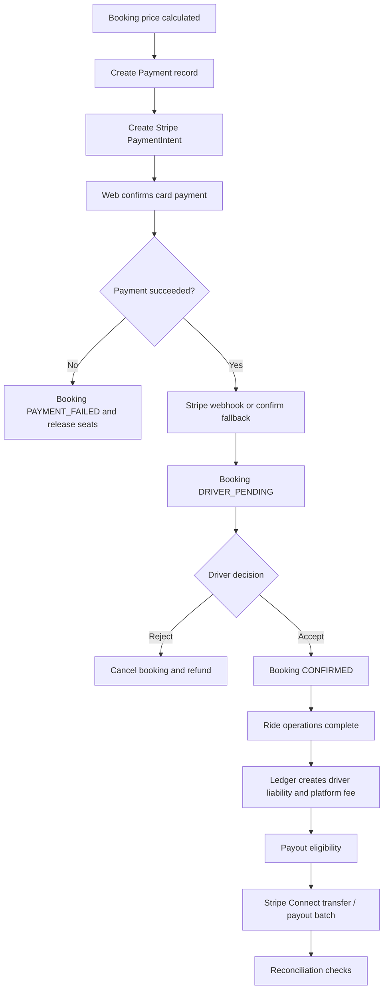

## Ride-Day Operations Flow

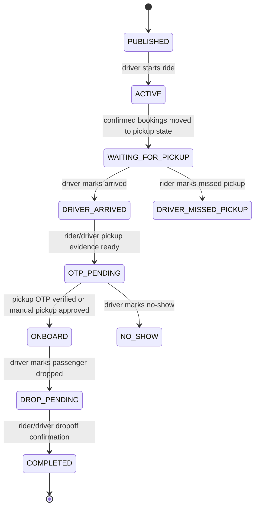

## Live Tracking Flow

```mermaid
sequenceDiagram
  participant Driver
  participant API as Tracking/Ride Operations API
  participant DB as LocationUpdate
  participant Socket as Socket.IO
  participant Rider
  participant Link as Public Tracking Link

  Driver->>API: submit current location
  API->>DB: persist location update
  API->>Socket: emit ride:location
  Socket-->>Rider: driver position update
  Rider->>API: refresh ride/tracking state
  Link->>API: GET /tracking/:token
  API-->>Link: read-only route and latest location
```

## Notification Delivery Flow

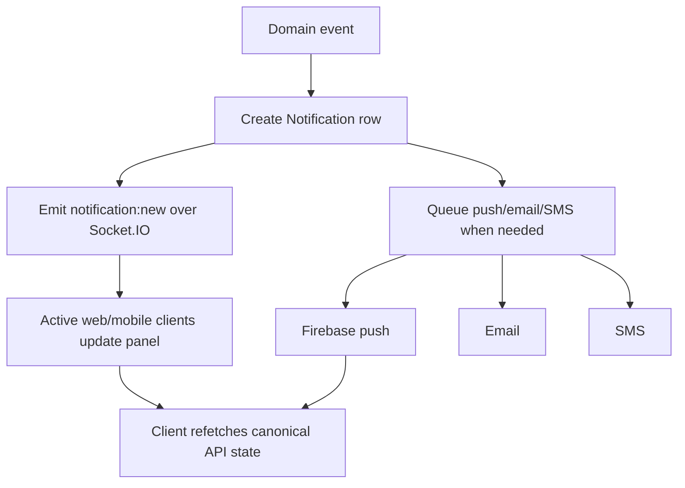

## Dispute And Reconciliation Flow

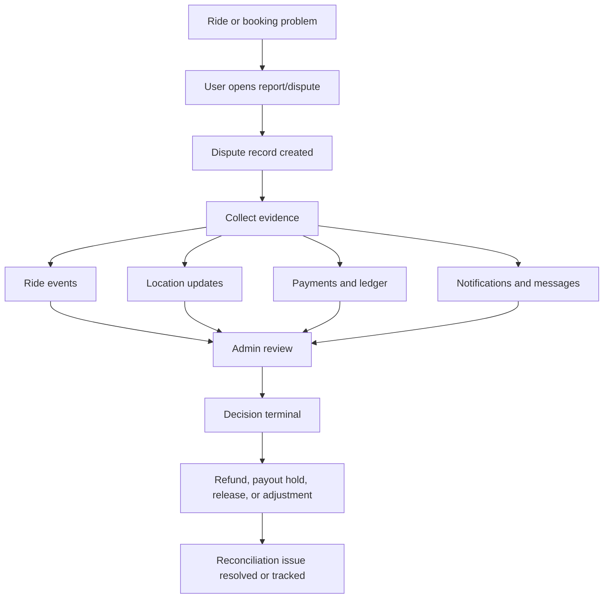

## Deployment Topology

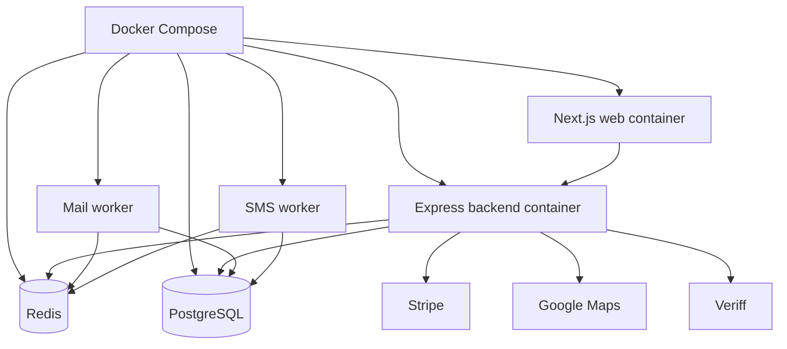
