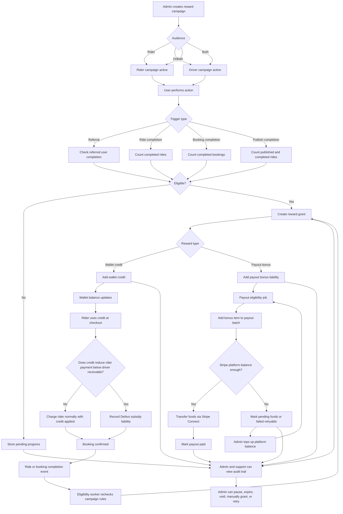
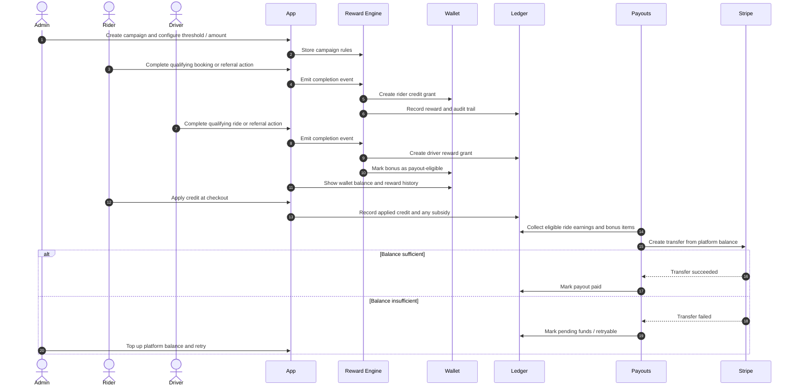

# Referral And Wallet Rewards Flow Diagram

This diagram shows how Deliivo handles configurable referral rewards, ride milestone rewards, wallet balances, and Stripe Connect payout movement.

## Sequence View

