# Carpooling Backend - Design Document

## 1. System Overview

A real-time carpooling platform connecting drivers offering rides with passengers searching for affordable travel. Built on Node.js/Express with TypeScript, PostgreSQL (Prisma ORM), Redis, BullMQ job queues, Socket.IO for real-time communication, and Stripe for payments.

---

## 2. High-Level Architecture

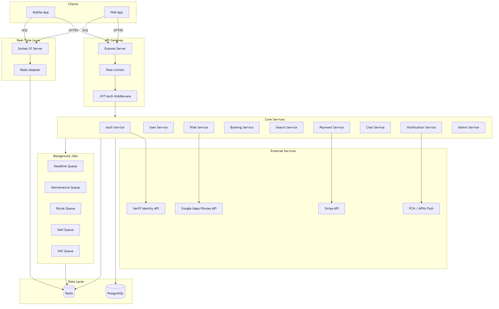

Mermaid source

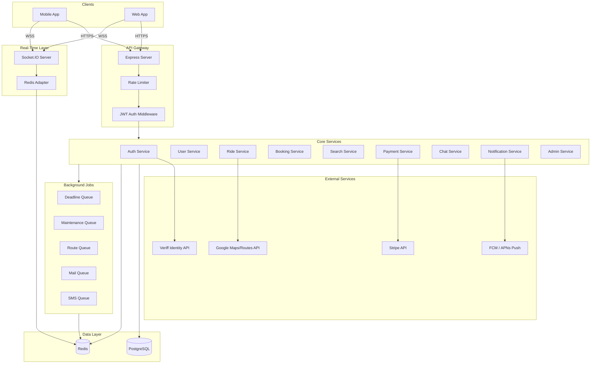
```mermaid
graph TB
    subgraph Clients
        MA[Mobile App]
        WA[Web App]
    end

    subgraph API_Gateway[API Gateway]
        EX[Express Server]
        RL[Rate Limiter]
        AUTH[JWT Auth Middleware]
    end

    subgraph Core_Services[Core Services]
        AS[Auth Service]
        US[User Service]
        RS[Ride Service]
        BS[Booking Service]
        SS[Search Service]
        PS[Payment Service]
        CS[Chat Service]
        NS[Notification Service]
        AD[Admin Service]
    end

    subgraph Realtime[Real-Time Layer]
        SIO[Socket.IO Server]
        RA[Redis Adapter]
    end

    subgraph Jobs[Background Jobs]
        DQ[Deadline Queue]
        MQ[Maintenance Queue]
        RQ[Route Queue]
        MQL[Mail Queue]
        SMQ[SMS Queue]
    end

    subgraph External[External Services]
        STR[Stripe API]
        GOO[Google Maps/Routes API]
        VRF[Veriff Identity API]
        FCM[FCM / APNs Push]
    end

    subgraph Data[Data Layer]
        PG[(PostgreSQL)]
        RD[(Redis)]
    end

    MA -->|HTTPS| EX
    WA -->|HTTPS| EX
    MA -->|WSS| SIO
    WA -->|WSS| SIO
    EX --> RL
    RL --> AUTH
    AUTH --> Core_Services
    SIO --> RA
    RA --> RD
    Core_Services --> PG
    Core_Services --> RD
    Core_Services --> Jobs
    Jobs --> RD
    PS --> STR
    RS --> GOO
    NS --> FCM
    AS --> VRF
```

---

## 3. Use Case Diagram

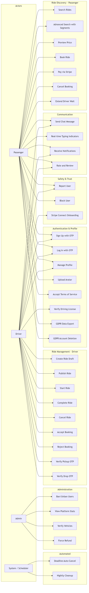

Mermaid source

```mermaid
graph LR
    subgraph Actors
        P[Passenger]
        D[Driver]
        A[Admin]
        SYS[System / Scheduler]
    end

    subgraph "Authentication & Profile"
        UC1[Sign Up with OTP]
        UC2[Log In with OTP]
        UC3[Manage Profile]
        UC4[Upload Avatar]
        UC5[Accept Terms of Service]
        UC6[Verify Driving License]
        UC7[GDPR Data Export]
        UC8[GDPR Account Deletion]
    end

    subgraph "Ride Management - Driver"
        UC10[Create Ride Draft]
        UC11[Publish Ride]
        UC12[Start Ride]
        UC13[Complete Ride]
        UC14[Cancel Ride]
        UC15[Accept Booking]
        UC16[Reject Booking]
        UC17[Verify Pickup OTP]
        UC18[Verify Drop OTP]
    end

    subgraph "Ride Discovery - Passenger"
        UC20[Search Rides]
        UC21[Advanced Search with Segments]
        UC22[Preview Price]
        UC23[Book Ride]
        UC24[Pay via Stripe]
        UC25[Cancel Booking]
        UC26[Extend Driver Wait]
    end

    subgraph "Communication"
        UC30[Send Chat Message]
        UC31[Real-time Typing Indicators]
        UC32[Receive Notifications]
        UC33[Rate and Review]
    end

    subgraph "Safety & Trust"
        UC40[Report User]
        UC41[Block User]
        UC42[Stripe Connect Onboarding]
    end

    subgraph "Administration"
        UC50[Ban/Unban Users]
        UC51[View Platform Stats]
        UC52[Verify Vehicles]
        UC53[Force Refund]
    end

    subgraph "Automated"
        UC60[Deadline Auto-Cancel]
        UC61[Nightly Cleanup]
    end

    P --> UC1 & UC2 & UC3 & UC4 & UC5 & UC7 & UC8
    P --> UC20 & UC21 & UC22 & UC23 & UC24 & UC25 & UC26
    P --> UC30 & UC31 & UC32 & UC33
    P --> UC40 & UC41

    D --> UC1 & UC2 & UC3 & UC6 & UC42
    D --> UC10 & UC11 & UC12 & UC13 & UC14
    D --> UC15 & UC16 & UC17 & UC18
    D --> UC30 & UC32 & UC33 & UC40

    A --> UC50 & UC51 & UC52 & UC53

    SYS --> UC60 & UC61
```

---

## 4. Core Flow Diagrams

### 4.1 Authentication Flow

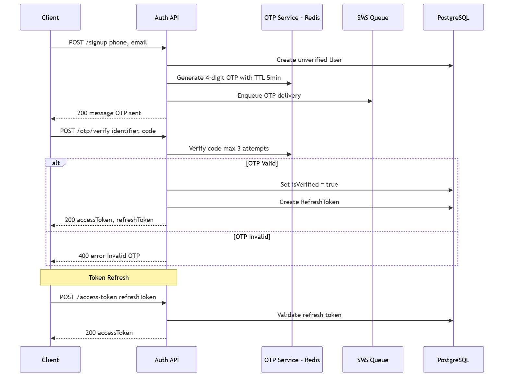

Mermaid source

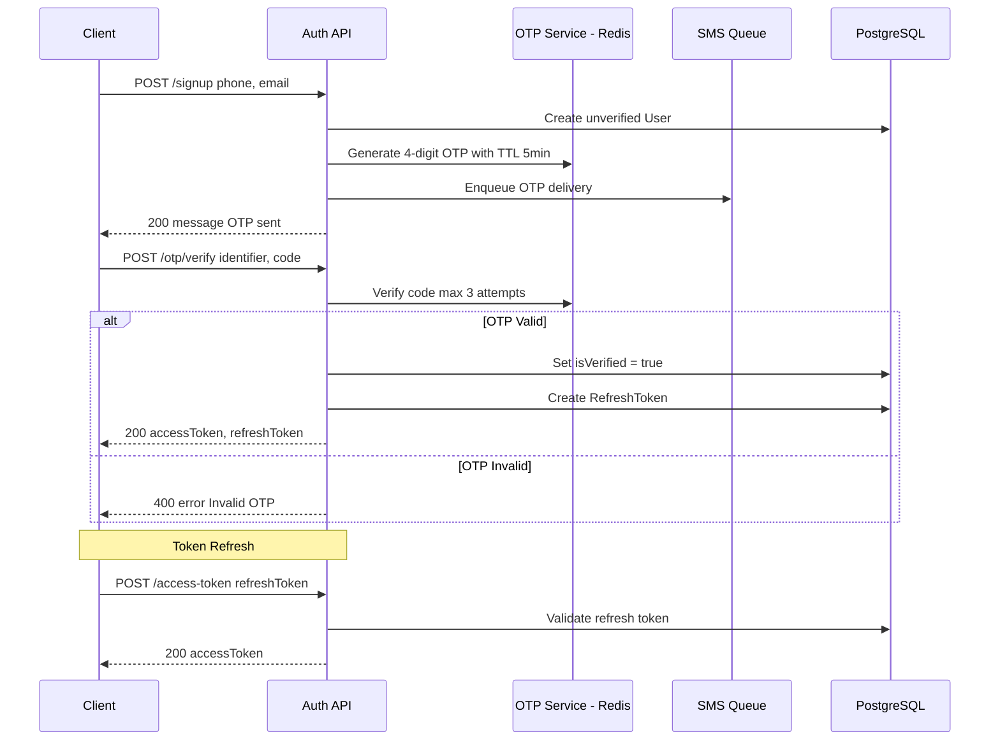
```mermaid
sequenceDiagram
    participant C as Client
    participant API as Auth API
    participant OTP as OTP Service - Redis
    participant SMS as SMS Queue
    participant DB as PostgreSQL

    C->>API: POST /signup phone, email
    API->>DB: Create unverified User
    API->>OTP: Generate 4-digit OTP with TTL 5min
    API->>SMS: Enqueue OTP delivery
    API-->>C: 200 message OTP sent

    C->>API: POST /otp/verify identifier, code
    API->>OTP: Verify code max 3 attempts
    alt OTP Valid
        API->>DB: Set isVerified = true
        API->>DB: Create RefreshToken
        API-->>C: 200 accessToken, refreshToken
    else OTP Invalid
        API-->>C: 400 error Invalid OTP
    end

    Note over C,API: Token Refresh
    C->>API: POST /access-token refreshToken
    API->>DB: Validate refresh token
    API-->>C: 200 accessToken
```

### 4.2 Ride Publishing Flow (Driver)

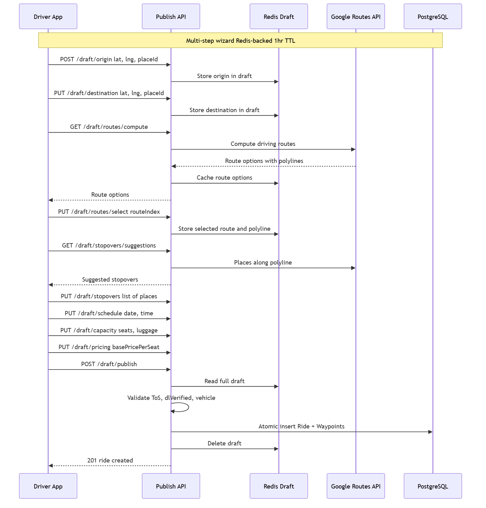

Mermaid source

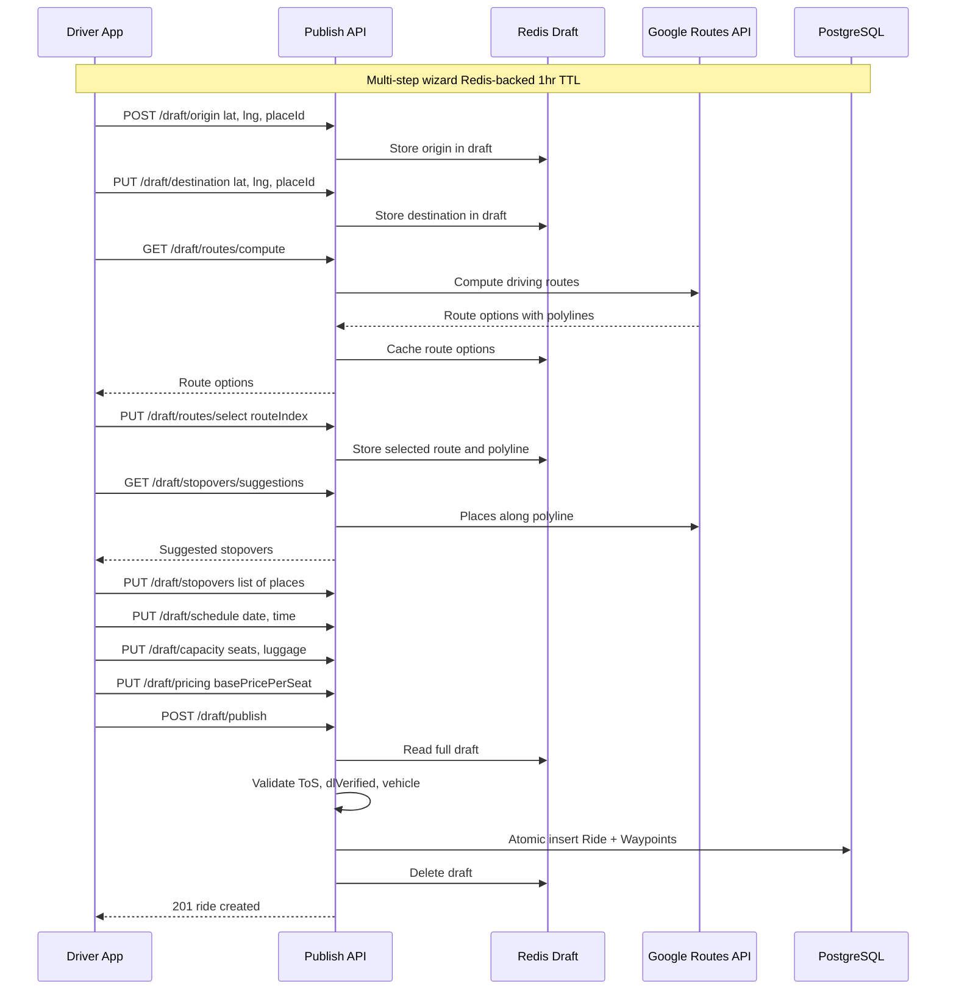
```mermaid
sequenceDiagram
    participant D as Driver App
    participant API as Publish API
    participant RDS as Redis Draft
    participant GOO as Google Routes API
    participant DB as PostgreSQL

    Note over D,DB: Multi-step wizard Redis-backed 1hr TTL

    D->>API: POST /draft/origin lat, lng, placeId
    API->>RDS: Store origin in draft

    D->>API: PUT /draft/destination lat, lng, placeId
    API->>RDS: Store destination in draft

    D->>API: GET /draft/routes/compute
    API->>GOO: Compute driving routes
    GOO-->>API: Route options with polylines
    API->>RDS: Cache route options
    API-->>D: Route options

    D->>API: PUT /draft/routes/select routeIndex
    API->>RDS: Store selected route and polyline

    D->>API: GET /draft/stopovers/suggestions
    API->>GOO: Places along polyline
    API-->>D: Suggested stopovers

    D->>API: PUT /draft/stopovers list of places
    D->>API: PUT /draft/schedule date, time
    D->>API: PUT /draft/capacity seats, luggage
    D->>API: PUT /draft/pricing basePricePerSeat

    D->>API: POST /draft/publish
    API->>RDS: Read full draft
    API->>API: Validate ToS, dlVerified, vehicle
    API->>DB: Atomic insert Ride + Waypoints
    API->>RDS: Delete draft
    API-->>D: 201 ride created
```

### 4.3 Search & Booking Flow (Passenger)

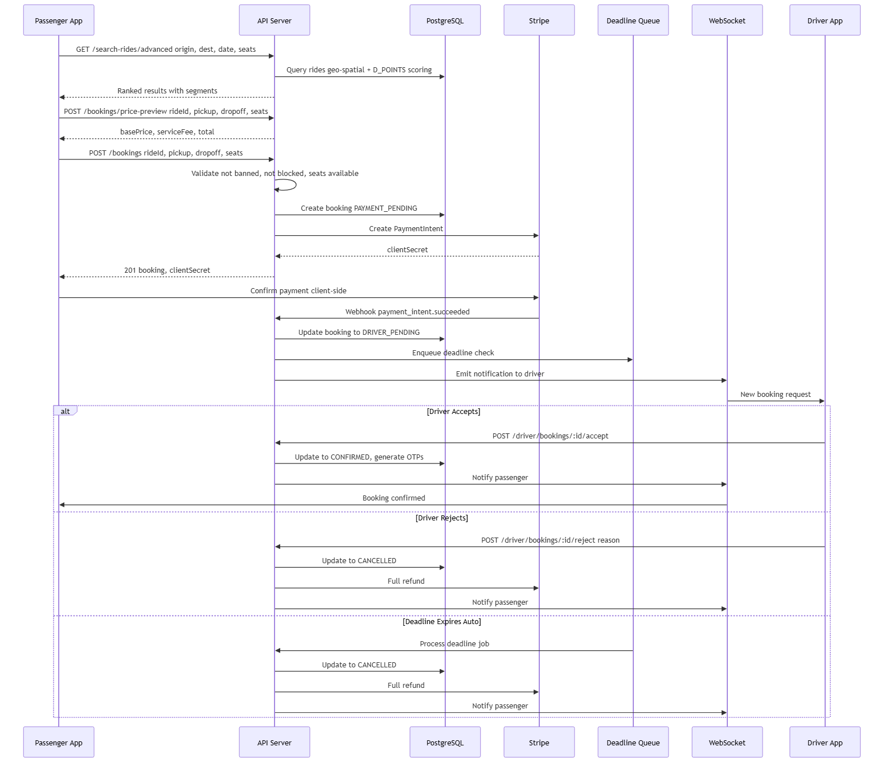

Mermaid source

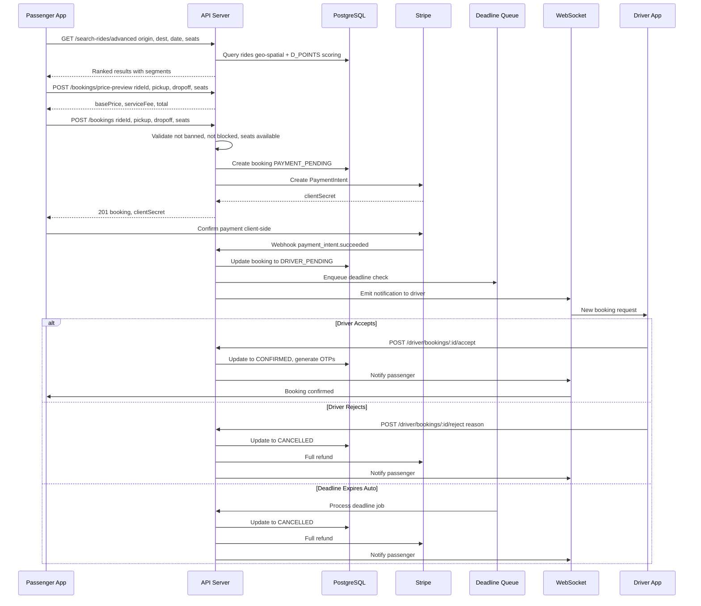
```mermaid
sequenceDiagram
    participant P as Passenger App
    participant API as API Server
    participant DB as PostgreSQL
    participant STR as Stripe
    participant Q as Deadline Queue
    participant WS as WebSocket
    participant D as Driver App

    P->>API: GET /search-rides/advanced origin, dest, date, seats
    API->>DB: Query rides geo-spatial + D_POINTS scoring
    API-->>P: Ranked results with segments

    P->>API: POST /bookings/price-preview rideId, pickup, dropoff, seats
    API-->>P: basePrice, serviceFee, total

    P->>API: POST /bookings rideId, pickup, dropoff, seats
    API->>API: Validate not banned, not blocked, seats available
    API->>DB: Create booking PAYMENT_PENDING
    API->>STR: Create PaymentIntent
    STR-->>API: clientSecret
    API-->>P: 201 booking, clientSecret

    P->>STR: Confirm payment client-side
    STR->>API: Webhook payment_intent.succeeded
    API->>DB: Update booking to DRIVER_PENDING
    API->>Q: Enqueue deadline check
    API->>WS: Emit notification to driver
    WS->>D: New booking request

    alt Driver Accepts
        D->>API: POST /driver/bookings/:id/accept
        API->>DB: Update to CONFIRMED, generate OTPs
        API->>WS: Notify passenger
        WS->>P: Booking confirmed
    else Driver Rejects
        D->>API: POST /driver/bookings/:id/reject reason
        API->>DB: Update to CANCELLED
        API->>STR: Full refund
        API->>WS: Notify passenger
    else Deadline Expires Auto
        Q->>API: Process deadline job
        API->>DB: Update to CANCELLED
        API->>STR: Full refund
        API->>WS: Notify passenger
    end
```

### 4.4 Ride Execution Flow (OTP Verification)

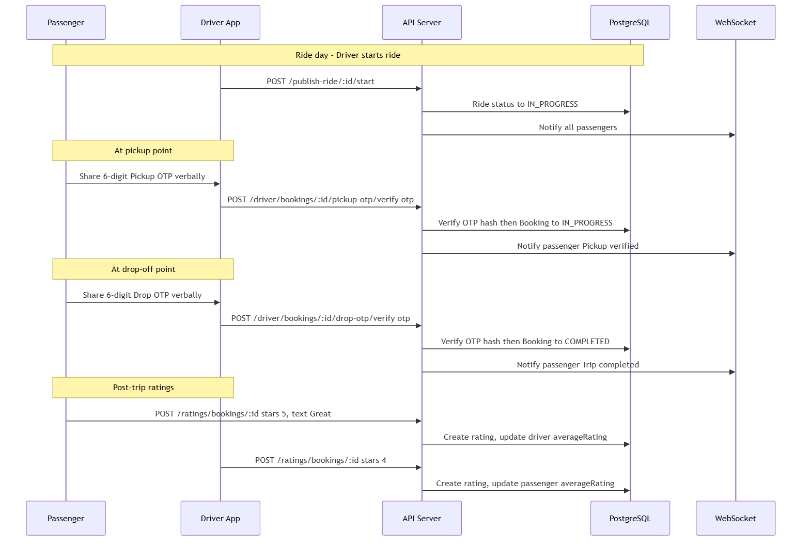

Mermaid source

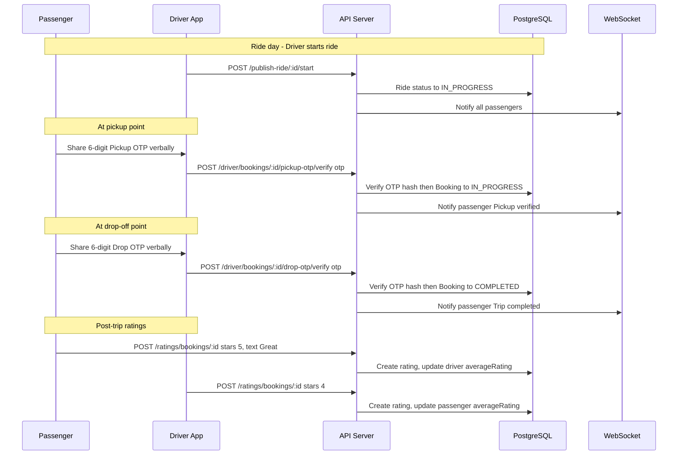
```mermaid
sequenceDiagram
    participant P as Passenger
    participant D as Driver App
    participant API as API Server
    participant DB as PostgreSQL
    participant WS as WebSocket

    Note over P,DB: Ride day - Driver starts ride

    D->>API: POST /publish-ride/:id/start
    API->>DB: Ride status to IN_PROGRESS
    API->>WS: Notify all passengers

    Note over P,D: At pickup point

    P->>D: Share 6-digit Pickup OTP verbally
    D->>API: POST /driver/bookings/:id/pickup-otp/verify otp
    API->>DB: Verify OTP hash then Booking to IN_PROGRESS
    API->>WS: Notify passenger Pickup verified

    Note over P,D: At drop-off point

    P->>D: Share 6-digit Drop OTP verbally
    D->>API: POST /driver/bookings/:id/drop-otp/verify otp
    API->>DB: Verify OTP hash then Booking to COMPLETED
    API->>WS: Notify passenger Trip completed

    Note over P,D: Post-trip ratings

    P->>API: POST /ratings/bookings/:id stars 5, text Great
    API->>DB: Create rating, update driver averageRating

    D->>API: POST /ratings/bookings/:id stars 4
    API->>DB: Create rating, update passenger averageRating
```

### 4.5 Real-Time Chat Flow

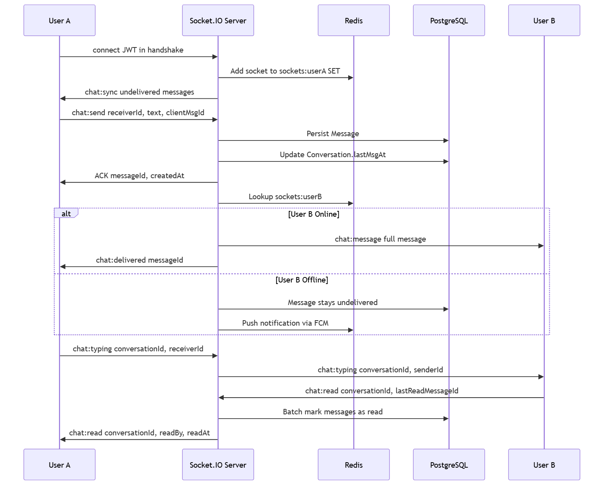

Mermaid source

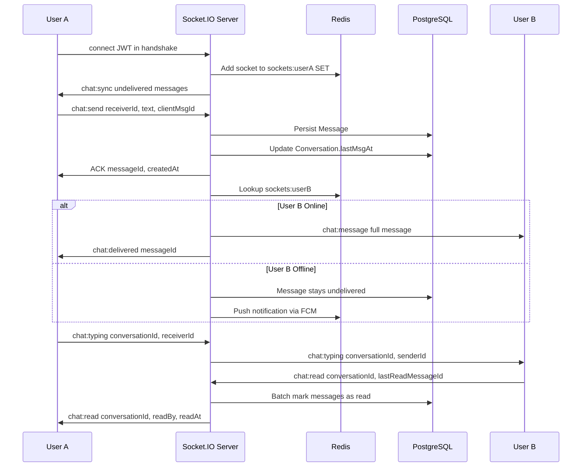
```mermaid
sequenceDiagram
    participant A as User A
    participant WS as Socket.IO Server
    participant RDS as Redis
    participant DB as PostgreSQL
    participant B as User B

    A->>WS: connect JWT in handshake
    WS->>RDS: Add socket to sockets:userA SET
    WS->>A: chat:sync undelivered messages

    A->>WS: chat:send receiverId, text, clientMsgId
    WS->>DB: Persist Message
    WS->>DB: Update Conversation.lastMsgAt
    WS->>A: ACK messageId, createdAt
    WS->>RDS: Lookup sockets:userB
    alt User B Online
        WS->>B: chat:message full message
        WS->>A: chat:delivered messageId
    else User B Offline
        WS->>DB: Message stays undelivered
        WS->>RDS: Push notification via FCM
    end

    A->>WS: chat:typing conversationId, receiverId
    WS->>B: chat:typing conversationId, senderId

    B->>WS: chat:read conversationId, lastReadMessageId
    WS->>DB: Batch mark messages as read
    WS->>A: chat:read conversationId, readBy, readAt
```

---

## 5. State Machine Diagrams

### 5.1 Ride Status

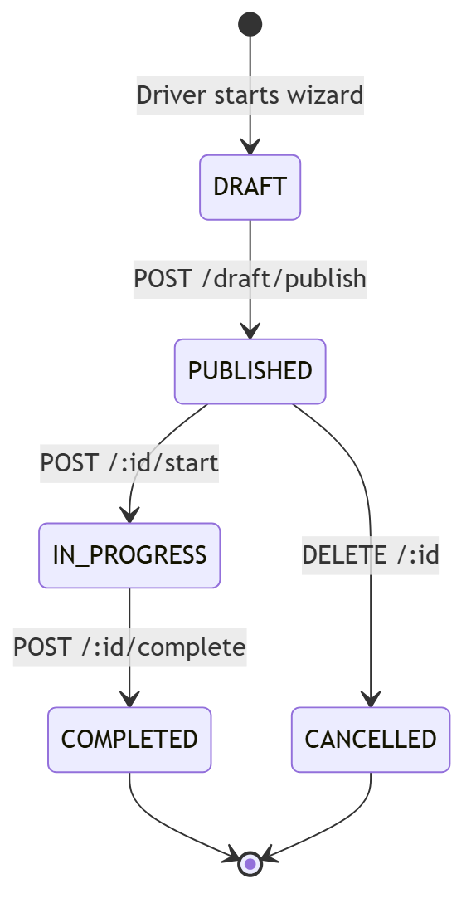

Mermaid source

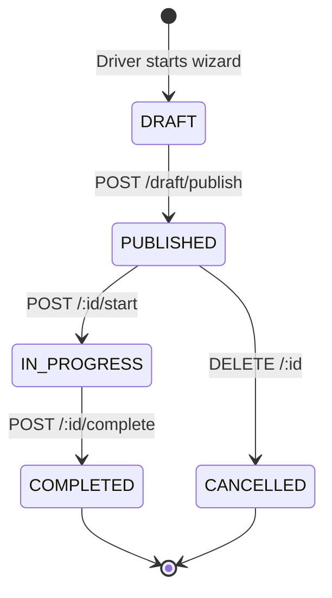
```mermaid
stateDiagram-v2
    [*] --> DRAFT: Driver starts wizard
    DRAFT --> PUBLISHED: POST /draft/publish
    PUBLISHED --> IN_PROGRESS: POST /:id/start
    PUBLISHED --> CANCELLED: DELETE /:id
    IN_PROGRESS --> COMPLETED: POST /:id/complete
    COMPLETED --> [*]
    CANCELLED --> [*]
```

### 5.2 Booking Status

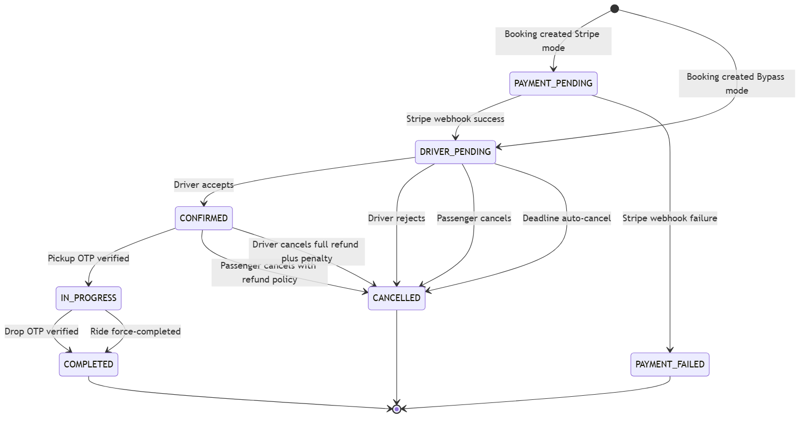

Mermaid source

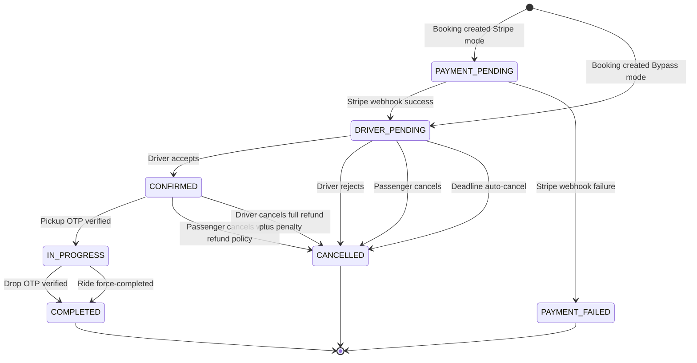
```mermaid
stateDiagram-v2
    [*] --> PAYMENT_PENDING: Booking created Stripe mode
    [*] --> DRIVER_PENDING: Booking created Bypass mode

    PAYMENT_PENDING --> DRIVER_PENDING: Stripe webhook success
    PAYMENT_PENDING --> PAYMENT_FAILED: Stripe webhook failure

    DRIVER_PENDING --> CONFIRMED: Driver accepts
    DRIVER_PENDING --> CANCELLED: Driver rejects
    DRIVER_PENDING --> CANCELLED: Passenger cancels
    DRIVER_PENDING --> CANCELLED: Deadline auto-cancel

    CONFIRMED --> IN_PROGRESS: Pickup OTP verified
    CONFIRMED --> CANCELLED: Passenger cancels with refund policy
    CONFIRMED --> CANCELLED: Driver cancels full refund plus penalty

    IN_PROGRESS --> COMPLETED: Drop OTP verified
    IN_PROGRESS --> COMPLETED: Ride force-completed

    PAYMENT_FAILED --> [*]
    COMPLETED --> [*]
    CANCELLED --> [*]
```

---

## 6. Data Model (Entity Relationship)

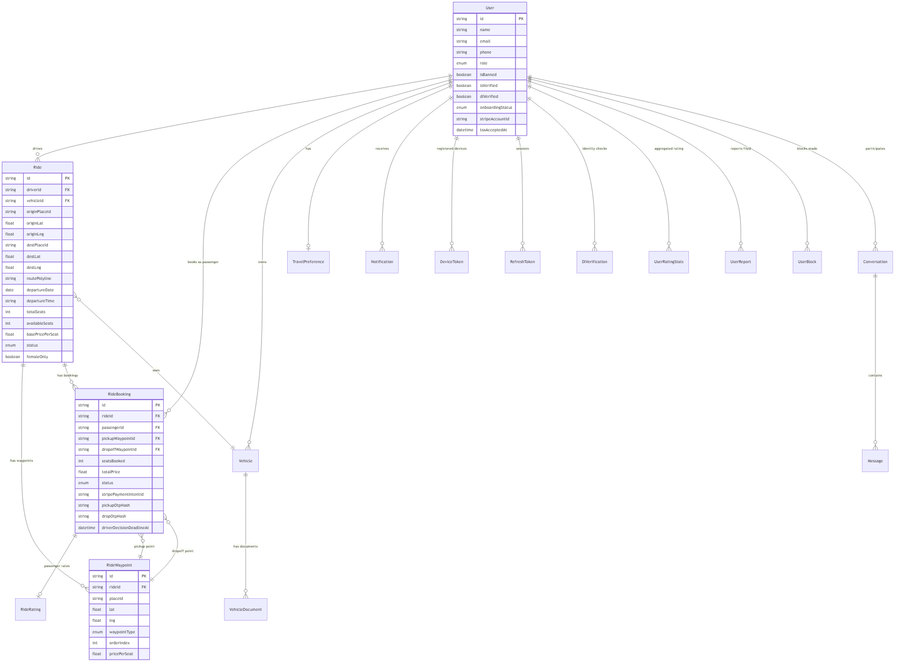

Mermaid source

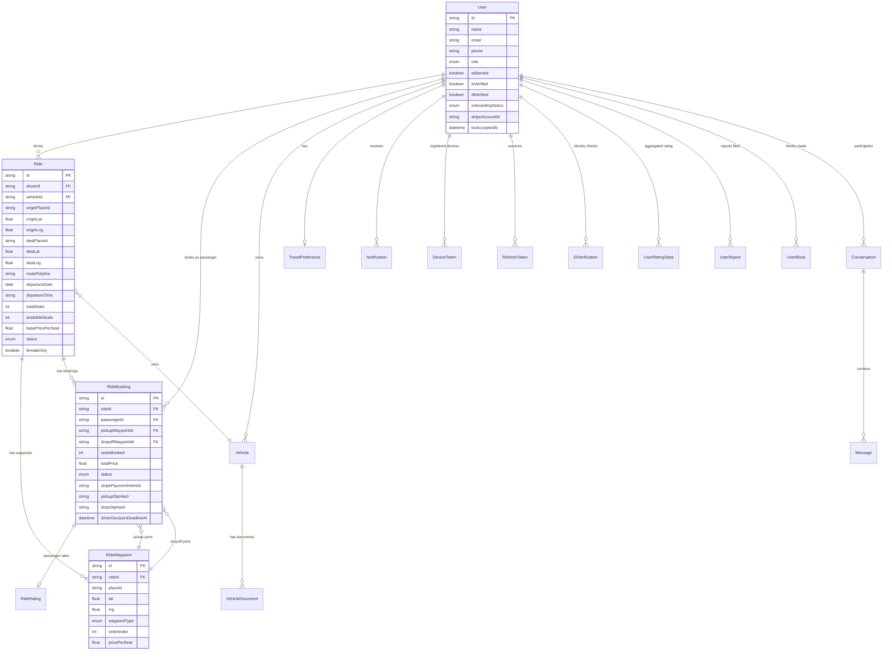
```mermaid
erDiagram
    User ||--o{ Ride : "drives"
    User ||--o{ RideBooking : "books as passenger"
    User ||--o{ Vehicle : "owns"
    User ||--o| TravelPreference : "has"
    User ||--o{ Notification : "receives"
    User ||--o{ DeviceToken : "registered devices"
    User ||--o{ RefreshToken : "sessions"
    User ||--o{ DlVerification : "identity checks"
    User ||--o{ UserRatingStats : "aggregated rating"
    User ||--o{ UserReport : "reports filed"
    User ||--o{ UserBlock : "blocks made"

    Ride ||--o{ RideWaypoint : "has waypoints"
    Ride ||--o{ RideBooking : "has bookings"
    Ride }o--|| Vehicle : "uses"

    RideBooking ||--o| RideRating : "passenger rates"
    RideBooking }o--|| RideWaypoint : "pickup point"
    RideBooking }o--|| RideWaypoint : "dropoff point"

    Conversation ||--o{ Message : "contains"
    User ||--o{ Conversation : "participates"

    Vehicle ||--o{ VehicleDocument : "has documents"

    User {
        string id PK
        string name
        string email
        string phone
        enum role
        boolean isBanned
        boolean isVerified
        boolean dlVerified
        enum onboardingStatus
        string stripeAccountId
        datetime tosAcceptedAt
    }

    Ride {
        string id PK
        string driverId FK
        string vehicleId FK
        string originPlaceId
        float originLat
        float originLng
        string destPlaceId
        float destLat
        float destLng
        string routePolyline
        date departureDate
        string departureTime
        int totalSeats
        int availableSeats
        float basePricePerSeat
        enum status
        boolean femaleOnly
    }

    RideBooking {
        string id PK
        string rideId FK
        string passengerId FK
        string pickupWaypointId FK
        string dropoffWaypointId FK
        int seatsBooked
        float totalPrice
        enum status
        string stripePaymentIntentId
        string pickupOtpHash
        string dropOtpHash
        datetime driverDecisionDeadlineAt
    }

    RideWaypoint {
        string id PK
        string rideId FK
        string placeId
        float lat
        float lng
        enum waypointType
        int orderIndex
        float pricePerSeat
    }
```

---

## 7. Advanced Search Algorithm (D_POINTS)

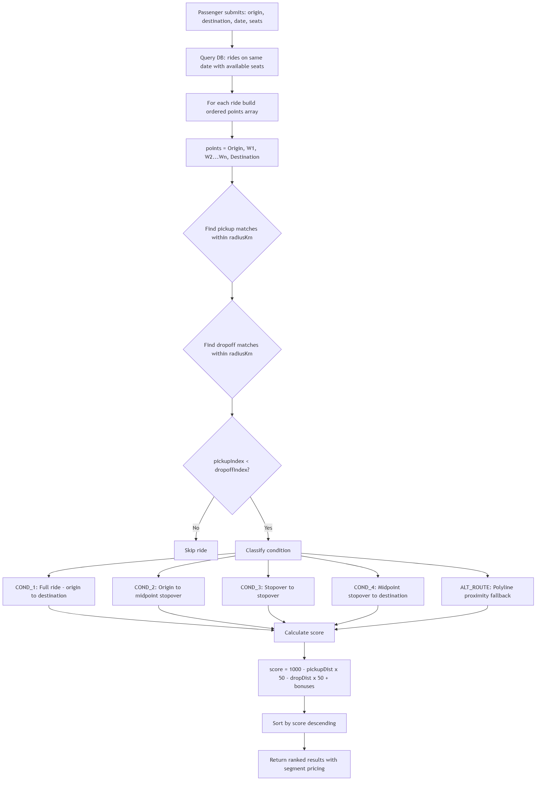

Mermaid source

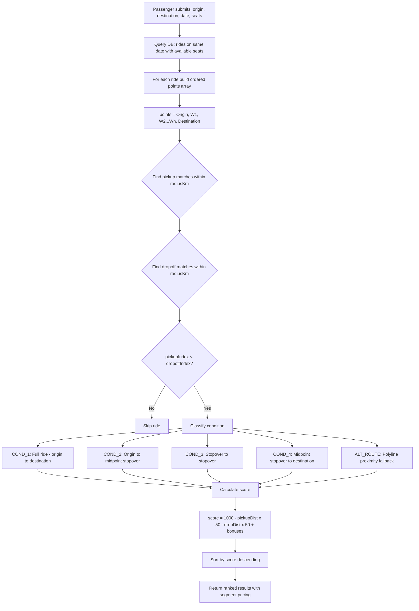
```mermaid
flowchart TD
    A[Passenger submits: origin, destination, date, seats] --> B[Query DB: rides on same date with available seats]
    B --> C[For each ride build ordered points array]
    C --> D["points = Origin, W1, W2...Wn, Destination"]
    D --> E{Find pickup matches within radiusKm}
    E --> F{Find dropoff matches within radiusKm}
    F --> G{pickupIndex < dropoffIndex?}
    G -->|No| H[Skip ride]
    G -->|Yes| I[Classify condition]

    I --> J[COND_1: Full ride - origin to destination]
    I --> K[COND_2: Origin to midpoint stopover]
    I --> L[COND_3: Stopover to stopover]
    I --> M[COND_4: Midpoint stopover to destination]
    I --> N[ALT_ROUTE: Polyline proximity fallback]

    J & K & L & M & N --> O[Calculate score]
    O --> P["score = 1000 - pickupDist x 50 - dropDist x 50 + bonuses"]
    P --> Q[Sort by score descending]
    Q --> R[Return ranked results with segment pricing]
```

---

## 8. Notification Delivery Pipeline

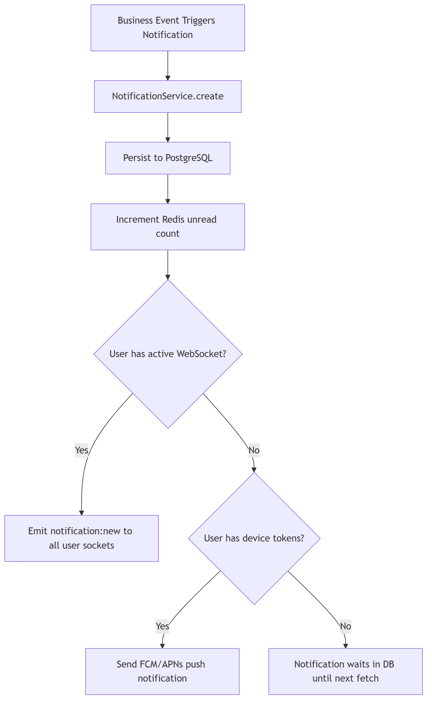

Mermaid source

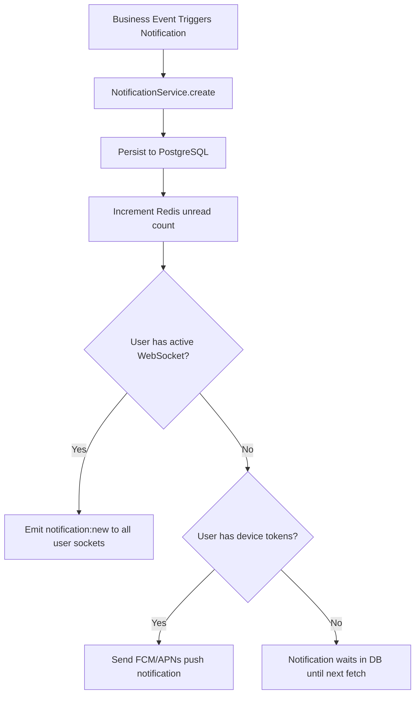
```mermaid
flowchart TD
    A[Business Event Triggers Notification] --> B[NotificationService.create]
    B --> C[Persist to PostgreSQL]
    C --> D[Increment Redis unread count]
    D --> E{User has active WebSocket?}
    E -->|Yes| F[Emit notification:new to all user sockets]
    E -->|No| G{User has device tokens?}
    G -->|Yes| H[Send FCM/APNs push notification]
    G -->|No| I[Notification waits in DB until next fetch]
```

---

## 9. Driver Decision Deadline Flow

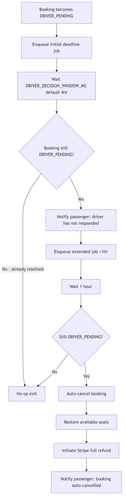

Mermaid source

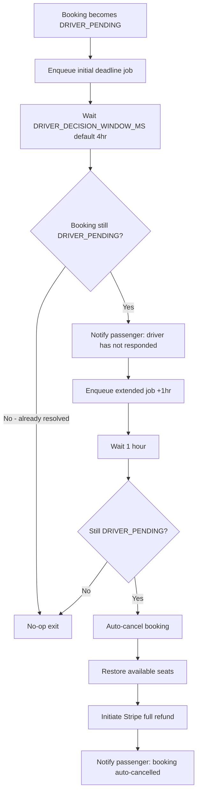
```mermaid
flowchart TD
    A[Booking becomes DRIVER_PENDING] --> B[Enqueue initial deadline job]
    B --> C["Wait DRIVER_DECISION_WINDOW_MS default 4hr"]
    C --> D{Booking still DRIVER_PENDING?}
    D -->|No - already resolved| E[No-op exit]
    D -->|Yes| F[Notify passenger: driver has not responded]
    F --> G[Enqueue extended job +1hr]
    G --> H[Wait 1 hour]
    H --> I{Still DRIVER_PENDING?}
    I -->|No| E
    I -->|Yes| J[Auto-cancel booking]
    J --> K[Restore available seats]
    K --> L[Initiate Stripe full refund]
    L --> M[Notify passenger: booking auto-cancelled]
```

---

## 10. Cancellation & Refund Policy

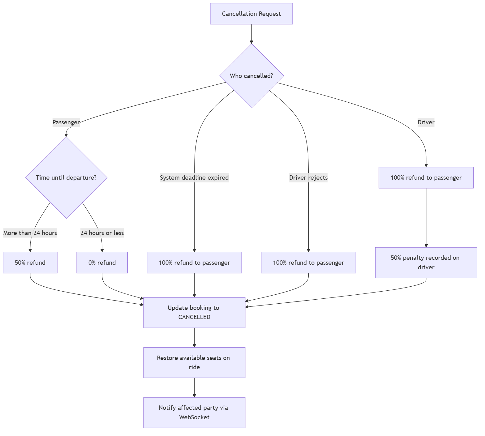

Mermaid source

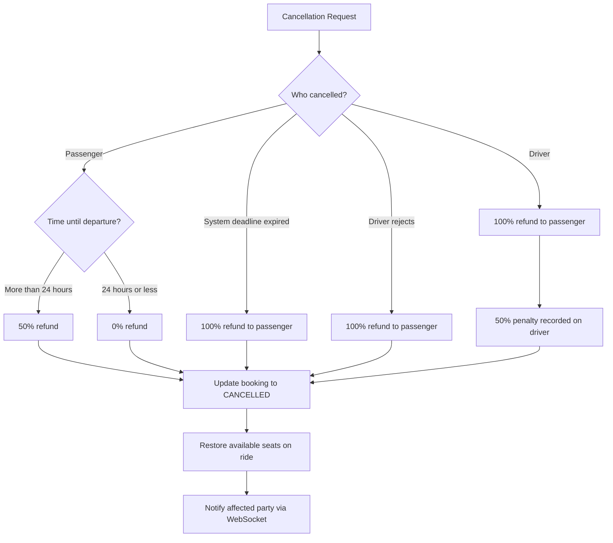
```mermaid
flowchart TD
    A[Cancellation Request] --> B{Who cancelled?}

    B -->|Passenger| C{Time until departure?}
    C -->|More than 24 hours| D[50% refund]
    C -->|24 hours or less| E[0% refund]

    B -->|Driver| F[100% refund to passenger]
    F --> G[50% penalty recorded on driver]

    B -->|System deadline expired| H[100% refund to passenger]

    B -->|Driver rejects| I[100% refund to passenger]

    D & E & H & I & G --> J[Update booking to CANCELLED]
    J --> K[Restore available seats on ride]
    K --> L[Notify affected party via WebSocket]
```

---

## 11. Component Interaction Map

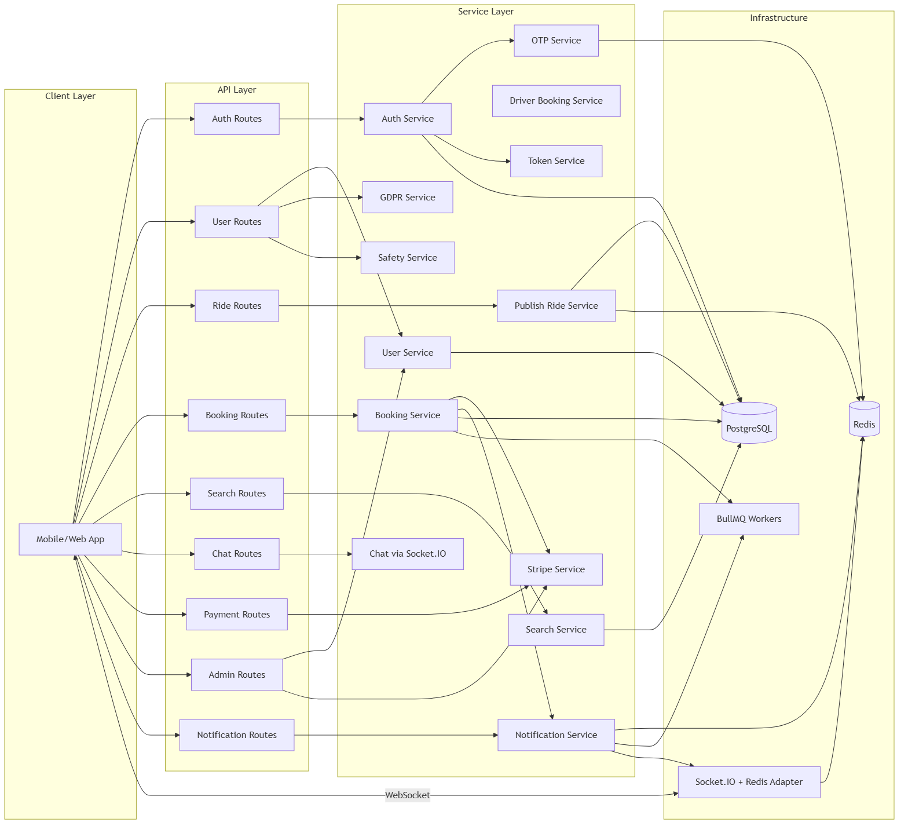

Mermaid source

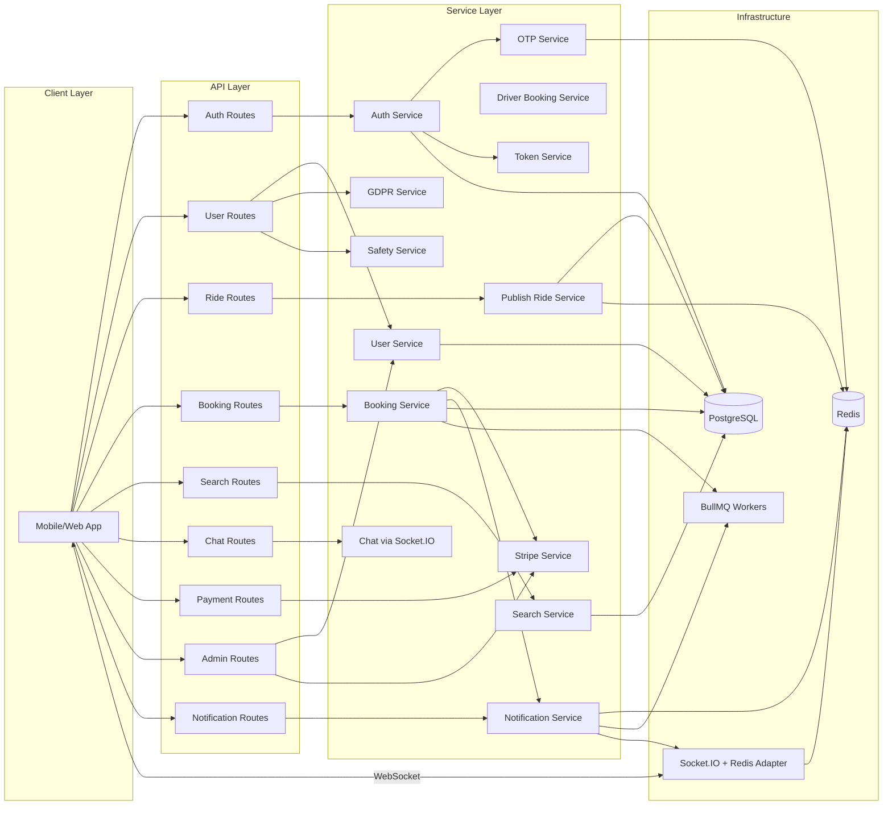
```mermaid
graph LR
    subgraph "Client Layer"
        APP[Mobile/Web App]
    end

    subgraph "API Layer"
        AUTH_R[Auth Routes]
        USER_R[User Routes]
        RIDE_R[Ride Routes]
        BOOK_R[Booking Routes]
        SEARCH_R[Search Routes]
        CHAT_R[Chat Routes]
        PAY_R[Payment Routes]
        ADMIN_R[Admin Routes]
        NOTIF_R[Notification Routes]
    end

    subgraph "Service Layer"
        AUTH_S[Auth Service]
        USER_S[User Service]
        RIDE_S[Publish Ride Service]
        BOOK_S[Booking Service]
        DBOOK_S[Driver Booking Service]
        SEARCH_S[Search Service]
        CHAT_S[Chat via Socket.IO]
        PAY_S[Stripe Service]
        NOTIF_S[Notification Service]
        OTP_S[OTP Service]
        TOKEN_S[Token Service]
        GDPR_S[GDPR Service]
        SAFETY_S[Safety Service]
    end

    subgraph "Infrastructure"
        PG[(PostgreSQL)]
        RD[(Redis)]
        BQ[BullMQ Workers]
        WS[Socket.IO + Redis Adapter]
    end

    APP --> AUTH_R & USER_R & RIDE_R & BOOK_R & SEARCH_R & CHAT_R & PAY_R & ADMIN_R & NOTIF_R
    APP <-->|WebSocket| WS

    AUTH_R --> AUTH_S --> OTP_S & TOKEN_S
    USER_R --> USER_S & GDPR_S & SAFETY_S
    RIDE_R --> RIDE_S
    BOOK_R --> BOOK_S --> PAY_S & NOTIF_S
    SEARCH_R --> SEARCH_S
    CHAT_R --> CHAT_S
    PAY_R --> PAY_S
    ADMIN_R --> USER_S & PAY_S
    NOTIF_R --> NOTIF_S

    AUTH_S & USER_S & RIDE_S & BOOK_S & SEARCH_S --> PG
    OTP_S & RIDE_S & NOTIF_S & WS --> RD
    BOOK_S & NOTIF_S --> BQ
    NOTIF_S --> WS
```

---

## 12. Deployment Architecture

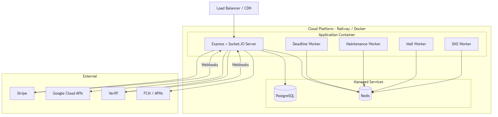

Mermaid source

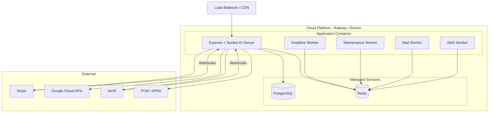
```mermaid
graph TB
    subgraph "Cloud Platform - Railway / Docker"
        subgraph "Application Container"
            APP[Express + Socket.IO Server]
            W1[Deadline Worker]
            W2[Maintenance Worker]
            W3[Mail Worker]
            W4[SMS Worker]
        end

        subgraph "Managed Services"
            PG[(PostgreSQL)]
            RD[(Redis)]
        end
    end

    subgraph "External"
        STR[Stripe]
        GOO[Google Cloud APIs]
        VRF[Veriff]
        PUSH[FCM / APNs]
    end

    LB[Load Balancer / CDN] --> APP
    APP --> PG & RD
    W1 & W2 & W3 & W4 --> RD
    APP --> STR & GOO & VRF & PUSH
    STR -->|Webhooks| APP
    VRF -->|Webhooks| APP
```

---

## 13. Security Architecture

| Layer | Mechanism |
|---|---|
| Transport | HTTPS/WSS only |
| Authentication | JWT (short-lived access + long-lived refresh tokens) |
| Authorization | Role-based (`USER`, `ADMIN`) via `authorize()` middleware |
| Rate Limiting | Global 100 req/min + OTP-specific 5 req/15min |
| Input Validation | Zod schemas on all endpoints |
| Payment Security | Stripe webhook signature verification (HMAC) |
| Identity Verification | Veriff KYC with HMAC-validated webhooks |
| Data Protection | GDPR export + right-to-deletion (anonymization) |
| User Safety | Block/Report system, banned user enforcement |
| CORS | Strict origin allowlist |
| Headers | Helmet.js security headers |

---

## 14. API Endpoint Summary

| Module | Base Path | Endpoints | Auth |
|---|---|---|---|
| Auth | `/api/v1/auth` | 8 | Public (except /accept-tos) |
| Users | `/api/v1/users` | 12 | Protected |
| Publish Ride | `/api/v1/publish-ride` | 17 | Protected |
| Search Rides | `/api/v1/search-rides` | 5 | Protected |
| Bookings | `/api/v1/bookings` | 7 | Protected |
| Driver Bookings | `/api/v1/driver/bookings` | 5 | Protected |
| Payments | `/api/v1/payments` | 3 | Mixed |
| Vehicles | `/api/v1/vehicles` | 9 | Protected |
| Chat | `/api/v1/chat` | 7 | Protected |
| Notifications | `/api/v1/notifications` | 5 | Protected |
| Ratings | `/api/v1/ratings` | 1 | Protected |
| Maps | `/api/v1/maps` | 6 | Protected |
| Travel Prefs | `/api/v1/travel-preferences` | 3 | Protected |
| DL Verification | `/api/v1/dl-verification` | 3 | Mixed |
| Admin | `/api/v1/admin` | 6 | Protected + ADMIN |

**Total: ~97 endpoints + WebSocket events**

---

## 15. Technology Stack

| Component | Technology |
|---|---|
| Runtime | Node.js 18+ |
| Language | TypeScript |
| Framework | Express.js |
| ORM | Prisma |
| Database | PostgreSQL |
| Cache / Pub-Sub | Redis (ioredis) |
| Job Queue | BullMQ |
| Real-time | Socket.IO + Redis Adapter |
| Payments | Stripe (PaymentIntents + Connect) |
| Maps | Google Routes API, Places API |
| Identity | Veriff |
| Push | Firebase Cloud Messaging / APNs |
| Validation | Zod |
| Auth | JWT (jsonwebtoken) |
| File Upload | Multer (memory storage) |
| Security | Helmet, CORS, rate-limiting |
| Containerization | Docker + docker-compose |
