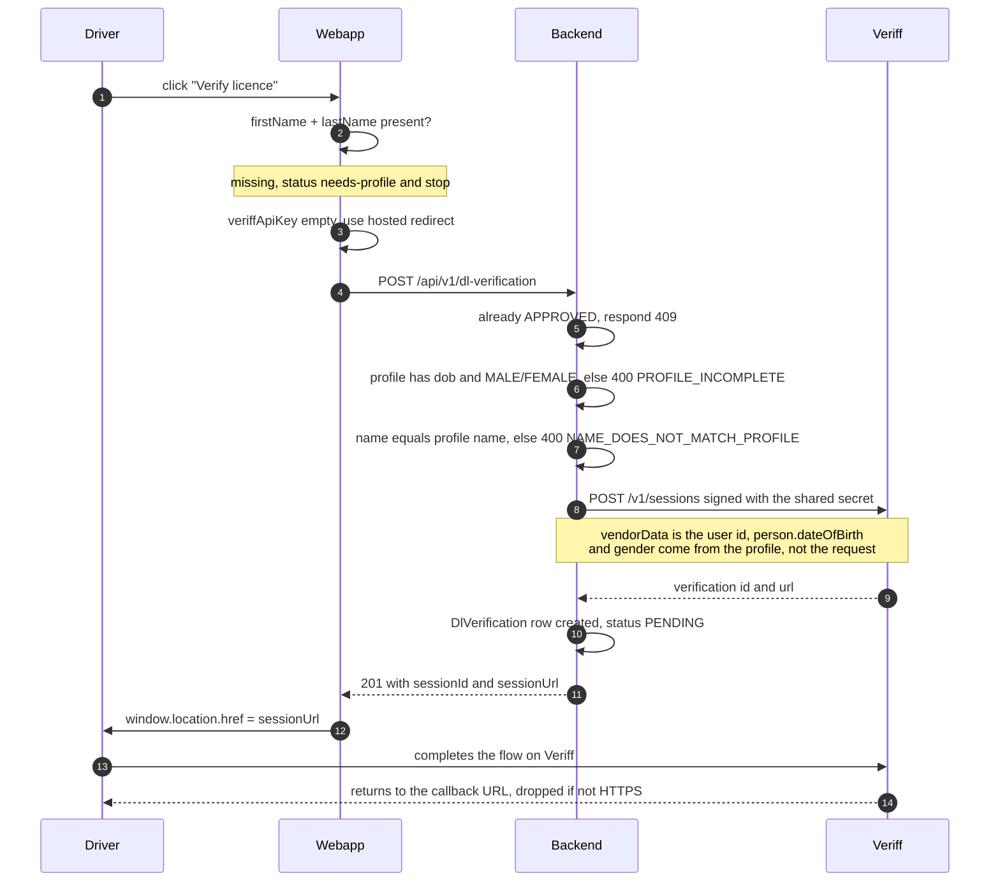
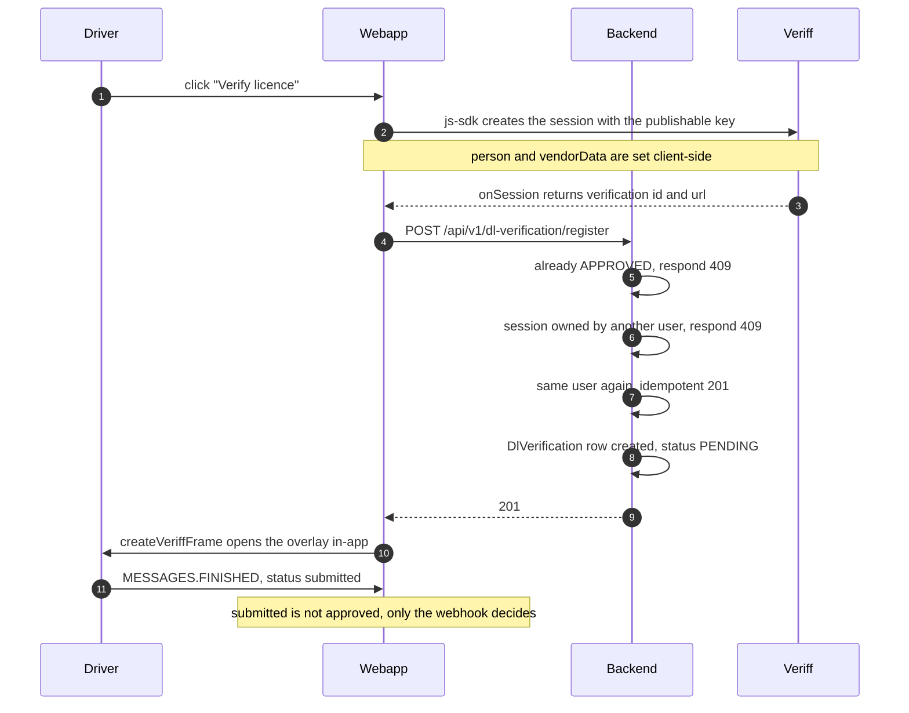
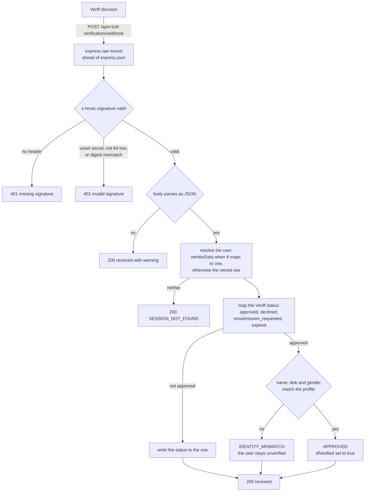
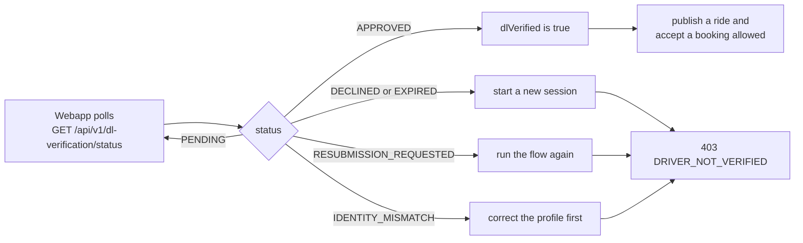

# DL Verification — How the Flow Works

Driving-licence KYC runs through Veriff. **Two session paths exist**, and which one runs is
decided in the webapp at `src/components/DlVerification.tsx` (`start`), by whether
`NEXT_PUBLIC_VERIFF_API_KEY` is set:

| Key | Path | What the driver sees |
|---|---|---|
| empty | **A** — backend creates the session | full-page redirect to `alchemy.veriff.com` |
| set | **B** — browser SDK creates the session | in-app overlay, never leaves the site |

Today the key is not set in `.env.local`, so **path A is what actually runs**.

Both paths end at the same decision webhook, and only that webhook can set
`dlVerified = true`.

---

## Path A — hosted redirect (active today)

Gate lives in `createVeriffSession` — `src/modules/dl-verification/dl-verification.service.ts`.
It refuses up front anything the webhook would refuse later, so a doomed check is never
paid for.

---

## Path B — browser SDK creates the session

`registerVeriffSession` exists because the backend never sees a client-created session
otherwise, and a decision with no row has nothing to attach to.

**The pre-flight gate does not run on this path.** The profile-completeness and name checks
live in `createVeriffSession`, which path B never calls, so a driver can burn a Veriff check
on data that the webhook will then refuse.

---

## Decision webhook — identical for both paths

- The signature covers the **raw bytes**. The route is mounted at the exact path
  `/api/v1/dl-verification/webhook` with `express.raw()` ahead of `express.json()` in
  `src/app.ts` — re-serialising a parsed body changes the digest and rejects every real
  decision.
- Every processing outcome answers `200` so Veriff does not retry. Only signature problems
  return `401`.
- `vendorData` is set by the backend on path A and by the client on path B. Either way an
  approval is honoured only when the document identity matches the stored profile, so a
  client cannot verify itself by choosing what it sends.

---

## After the flow

`IDENTITY_MISMATCH` means the licence was readable but its name, date of birth or gender did
not match the profile. Retrying with the same profile fails the same way — the profile has to
be corrected first.

See `docs/guides/frontend-integration-guide.md` §5 for the client-side steps and the copy to
show for each status.
